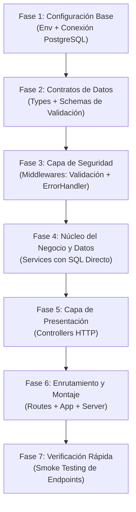
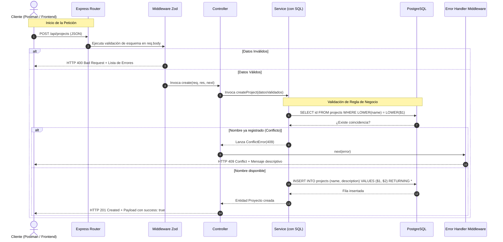

# Guía Maestra: Construcción de Backend REST en 30 Minutos (Sin IA y Sin Código)

**Proyecto:** TaskFlow TI — API de Gestión de Proyectos y Portafolios  
**Enfoque:** Preparación para Pruebas Técnicas en Vivo / Speedrun de Arquitectura  
**Duración Objetivo:** 30 minutos estrictos  
**Metodología:** Cero fragmentos de código fuente (TypeScript/SQL/JS). Todo el documento describe directrices, lógica de flujo, diseño de capas, algoritmos conceptuales y checklists operativas para que el desarrollador programe con autonomía, rapidez y precisión.

---

## 1. Estructura de Carpetas Optimizada

Para completar un backend profesional en 30 minutos, la fragmentación excesiva es el mayor enemigo: crear demasiados archivos pequeños genera pérdida de tiempo por navegación e importaciones. La arquitectura se organiza en torno a 5 carpetas funcionales centrales, preservando módulos específicos para tipado y validación de esquemas:

```text
backend/
├── src/
│   ├── config/             # Configuración del entorno y cliente de base de datos
│   ├── types/              # Definición de tipos, interfaces de dominio y DTOs
│   ├── schemas/            # Esquemas de validación de entradas con Zod
│   ├── middlewares/        # Interceptores de peticiones y gestor central de errores
│   ├── services/           # Lógica del negocio y consultas SQL directas
│   ├── controllers/        # Adaptadores HTTP (petición, códigos de estado y respuestas)
│   ├── routes/             # Definición de endpoints y asociación de middlewares
│   ├── app.ts              # Ensamblado de Express, middlewares globales y montaje de rutas
│   └── server.ts           # Inicialización del servidor HTTP y cierre ordenado
├── package.json            # Metadatos del proyecto, scripts y dependencias
├── tsconfig.json           # Configuración del compilador TypeScript
└── .env                    # Credenciales y variables de entorno locales
```

### Matriz de Responsabilidades y Decisiones de Diseño

| Carpeta / Archivo | Responsabilidad Principal | Optimización para los 30 Minutos |
| :--- | :--- | :--- |
| **`config/`** | Cargar variables de entorno y exponer el Pool de PostgreSQL con un helper para ejecutar consultas. | Evita inicializar clientes en cada archivo; centraliza la conexión una sola vez. |
| **`types/`** | Declarar los contratos de datos del modelo, entradas esperadas (DTOs) y respuestas de métricas. | Proporciona autocompletado y seguridad de tipos en TypeScript durante todo el desarrollo. |
| **`schemas/`** | Declarar reglas de validación estructural para el cuerpo (`body`) y parámetros (`params`) de la URL. | Aísla las reglas de validación para reutilizarlas en rutas sin ensuciar controladores. |
| **`middlewares/`** | Interceptar peticiones para validar entradas y capturar excepciones de forma homogénea. | Centraliza las clases de error (`AppError`) y el traductor de excepciones en un solo punto. |
| **`services/`** | Contener las reglas de negocio (unicidad, existencia previa) y ejecutar las sentencias SQL. | **Fusión clave**: Absorbe la capa de repositorios. El servicio ejecuta el SQL directamente, ahorrando crear archivos redundantes. |
| **`controllers/`** | Recibir la petición HTTP, extraer parámetros/cuerpo, delegar al servicio y emitir JSON con su código HTTP. | Los controladores son ultra delgados: no contienen lógica de negocio ni consultas SQL. |
| **`routes/`** | Definir los métodos HTTP (GET, POST, PATCH, DELETE) y encadenar validadores antes del controlador. | Permite ver el mapa completo de la API en un solo archivo legible. |
| **`app.ts`** | Crear la instancia de Express, registrar CORS, parseo JSON, montar rutas y colocar el error handler al final. | Separa la lógica de la aplicación del listener de red, permitiendo pruebas automatizadas. |
| **`server.ts`** | Escuchar en el puerto definido y escuchar la señal de terminación del sistema operativo. | Mantiene el archivo de arranque limpio y enfocado exclusivamente en el ciclo de vida del proceso. |

---

## 2. Modelo Mental y Flujo de Construcción

### 2.1. ¿En qué orden construir y por qué? (Estrategia Bottom-Up)

En una prueba contrarreloj, el orden de construcción determina si terminas a tiempo o te quedas bloqueado resolviendo errores de importaciones circulares o tipos no definidos.



**Justificación de la secuencia:**
1. **Configuración primero:** Sin conexión a base de datos y variables de entorno, no hay cimientos donde probar nada.
2. **Tipos y esquemas segundo:** Definen el vocabulario de toda la aplicación. Una vez definidos, TypeScript asiste en todo momento.
3. **Middlewares tercero:** Contar con el manejador de errores y las clases de error (`NotFoundError`, `ConflictError`) antes de escribir los servicios permite lanzar errores específicos desde el primer momento.
4. **Servicios cuarto:** Es donde reside el valor real: la interacción con la base de datos y las validaciones de negocio.
5. **Controladores y Rutas quinto:** Son adaptadores livianos que conectan el protocolo HTTP con los servicios ya listos.
6. **App y Server al final:** Enlaza todas las piezas y arranca el proceso en un par de minutos.

---

### 2.2. Ciclo de Vida de una Petición HTTP (Happy Path vs. Error Path)

El siguiente diagrama ilustra el recorrido exacto de una petición desde el cliente hasta la base de datos y su retorno:



---

## 3. Cronograma Timeboxing Estricto (30 Minutos)

| Bloque | Minutos | Objetivo Principal | Entregables Clave |
| :---: | :---: | :--- | :--- |
| **1** | **00:00 - 04:00** | Inicialización del proyecto, paquetes y conexión a BD | `package.json`, `tsconfig.json`, `.env`, `config/env.ts`, `config/database.ts` |
| **2** | **04:00 - 08:00** | Contratos de tipos del dominio y esquemas Zod | `types/project.types.ts`, `schemas/project.schema.ts` |
| **3** | **08:00 - 11:00** | Clases de error, manejador global y validador genérico | `middlewares/errorHandler.middleware.ts`, `middlewares/validate.middleware.ts` |
| **4** | **11:00 - 19:00** | Lógica de negocio completa y consultas SQL | `services/project.service.ts` (6 operaciones) |
| **5** | **19:00 - 23:00** | Adaptadores de petición/respuesta HTTP | `controllers/project.controller.ts` (6 métodos) |
| **6** | **23:00 - 27:00** | Enrutador, montaje en Express y arranque del servidor | `routes/project.routes.ts`, `routes/index.ts`, `app.ts`, `server.ts` |
| **7** | **27:00 - 30:00** | Prueba de humo integral y validación de reglas | Smoke testing en vivo de las 6 rutas |

---

## 4. Paso a Paso Detallado por Etapa (Sin Código)

### Bloque 1 [00:00 - 04:00]: Inicialización, Paquetes y Configuración Base

#### Paso 1.1: Inicialización del Proyecto
1. Abrir la terminal en la carpeta de destino del backend.
2. Inicializar el archivo de configuración de paquetes de Node con valores predeterminados.
3. Instalar las dependencias de producción indispensables:
   - Framework HTTP (`express`).
   - Habilitador de intercambio de recursos de origen cruzado (`cors`).
   - Gestor de variables de entorno (`dotenv`).
   - Controlador nativo de PostgreSQL (`pg`).
   - Librería de validación de esquemas basada en tipos (`zod`).
4. Instalar las dependencias de desarrollo esenciales:
   - Compilador de TypeScript (`typescript`).
   - Ejecutor veloz de TypeScript con recarga en caliente (`tsx`).
   - Definiciones de tipos para Node, Express, CORS y PG.
5. Configurar en el archivo de paquetes un script de desarrollo que ejecute el archivo del servidor con vigilancia activa de cambios (`tsx watch src/server.ts`).

#### Paso 1.2: Configuración del Compilador TypeScript
1. Crear el archivo de configuración del compilador.
2. Ajustar las opciones fundamentales:
   - Carpeta raíz de código fuente apuntando a `src`.
   - Carpeta de salida de compilación apuntando a `dist`.
   - Módulo y resolución de módulos ajustados a estándares modernos (`NodeNext` o `ESNext`).
   - Modo estricto activado para garantizar la seguridad de tipos.
   - Activación de interoperabilidad con módulos CommonJS.

#### Paso 1.3: Variables de Entorno y Configuración Central (`config/env.ts`)
1. Crear el archivo `.env` en la raíz con las claves de conexión a la base de datos (puerto del servidor, host de base de datos, puerto de PostgreSQL, usuario, contraseña y nombre de la base de datos).
2. En `src/config/env.ts`:
   - Invocar la carga de variables desde el archivo de entorno.
   - Construir y exportar un objeto inmutable de configuración que lea las propiedades de variables del sistema, proporcionando valores de respaldo por defecto (fallback) en caso de que alguna no esté definida (por ejemplo, puerto 3000 si no existe variable de puerto).

#### Paso 1.4: Conexión con PostgreSQL (`config/database.ts`)
1. Instanciar un grupo de conexiones compartidas (Connection Pool) utilizando la librería nativa de PostgreSQL y los valores extraídos del objeto central de configuración.
2. Suscribir listeners a los eventos del pool para registrar en consola cuando se abra una conexión exitosa y atrapar errores inesperados en clientes inactivos.
3. Crear y exportar una función utilitaria asíncrona de consulta genérica que reciba el texto de la sentencia SQL y un arreglo opcional de parámetros parametrizados, ejecutando la consulta sobre el pool y devolviendo el resultado tipado.

---

### Bloque 2 [04:00 - 08:00]: Tipos de Dominio y Esquemas de Validación

#### Paso 2.1: Modelado de Interfaces TypeScript (`types/project.types.ts`)
1. Declarar el tipo literal para el estado de los proyectos, restringido exclusivamente a dos valores: `ACTIVO` y `ARCHIVADO`.
2. Declarar la interfaz de la entidad `Project` reflejando fielmente las columnas de la tabla de base de datos:
   - Identificador único (cadena de texto en formato UUID).
   - Nombre del proyecto (cadena de texto).
   - Descripción (cadena de texto o nulo).
   - Estado del proyecto (utilizando el tipo literal anterior).
   - Fechas de creación y actualización (objetos fecha o cadenas ISO).
3. Declarar el DTO de creación (`CreateProjectDTO`): requiere obligatoriamente el nombre (cadena) y opcionalmente la descripción.
4. Declarar el DTO de actualización parcial (`UpdateProjectDTO`): todas las propiedades son opcionales (nombre, descripción y estado).
5. Declarar la interfaz para métricas agregadas (`ProjectMetrics`):
   - Identificador del proyecto y nombre del proyecto.
   - Conteo total de tareas asociadas (numérico).
   - Conteo de tareas completadas, en proceso y pendientes (numéricos).
   - Porcentaje de avance o completitud (numérico decimal).

#### Paso 2.2: Esquemas de Validación con Zod (`schemas/project.schema.ts`)
1. **Esquema de Creación de Proyecto:**
   - Campo `name`: Obligatorio, cadena de texto, aplicar recorte de espacios en blanco (trim), exigir una longitud mínima de 3 caracteres y máxima de 80 caracteres.
   - Campo `description`: Opcional, cadena de texto, recortar espacios, limitar a un máximo de 500 caracteres.
2. **Esquema de Actualización de Proyecto:**
   - Campo `name`: Opcional, con las mismas restricciones de longitud y recorte.
   - Campo `description`: Opcional, con la misma restricción de longitud máxima.
   - Campo `status`: Opcional, restringido estrictamente a los valores del enum (`ACTIVO` o `ARCHIVADO`).
3. **Esquema de Validación de Parámetro Identificador:**
   - Campo `id`: Obligatorio, cadena de texto validada como identificador único universal (UUID válido).

---

### Bloque 3 [08:00 - 11:00]: Capa de Resiliencia y Middlewares

#### Paso 3.1: Jerarquía de Errores y Manejador Global (`middlewares/errorHandler.middleware.ts`)
1. **Definición de Clases de Error de Negocio:**
   - Crear una clase base abstracta de error (`AppError`) que extienda de la clase nativa de errores de JavaScript y declare una propiedad abstracta para el código de estado HTTP.
   - Crear la clase `NotFoundError` con código de estado 404 y mensaje por defecto orientado a recursos inexistentes.
   - Crear la clase `ConflictError` con código de estado 409 y mensaje orientado a colisión de recursos o duplicados.
   - Crear la clase `BadRequestError` con código de estado 400 para solicitudes con parámetros o cuerpo incorrecto.
2. **Construcción del Middleware de Errores (4 parámetros de Express):**
   - Evaluar si el error recibido es una instancia de `AppError`: en caso afirmativo, responder inmediatamente con el código de estado propio del error y un JSON estructurado (`success: false`, `message`).
   - Evaluar si el error proviene del motor de base de datos PostgreSQL por violación de restricción única (código `23505`): responder con código de estado 409 y un mensaje amigable indicando que ya existe un registro con ese dato único.
   - Si no cumple ninguno de los anteriores, registrar el error en la consola del servidor y emitir una respuesta genérica con código de estado 500 (`Error interno del servidor`), protegiendo los detalles internos del sistema.

#### Paso 3.2: Middleware Genérico de Validación (`middlewares/validate.middleware.ts`)
1. **Validador del Cuerpo de la Petición (`validateBody`):**
   - Diseñar una función de orden superior que reciba un esquema de Zod y retorne un middleware de Express asíncrono.
   - En el bloque de ejecución, pasar el cuerpo de la petición (`req.body`) por la función de parseo asíncrono del esquema.
   - Reemplazar el `req.body` con el resultado sanitizado y llamar a la siguiente función en la cadena (`next()`).
   - Si se captura una excepción de tipo Zod, formatear los incidentes extrayendo el nombre del campo y el mensaje de validación, y responder con código HTTP 400 y el desglose de errores.
2. **Validador de Parámetros de Ruta (`validateParams`):**
   - Diseñar una función idéntica a la anterior, pero que ejecute la validación sobre el objeto de parámetros de ruta (`req.params`), respondiendo con código 400 si el parámetro (como el UUID) no cumple con el formato esperado.

---

### Bloque 4 [11:00 - 19:00]: Núcleo de Negocio y Persistencia SQL (`services/project.service.ts`)

En esta capa se concentran las 6 operaciones requeridas para cubrir la totalidad del backend actual, ejecutando consultas SQL seguras mediante marcadores de posición (`$1`, `$2`) para prevenir inyecciones SQL.

#### Operación 1: Listar Todos los Proyectos (`getAllProjects`)
- **Objetivo:** Retornar el listado completo de proyectos registrados.
- **Lógica SQL:** Ejecutar una consulta de selección de todas las columnas relevantes de la tabla de proyectos, ordenadas descendentemente por la fecha de creación para mostrar primero los más recientes.
- **Retorno:** El arreglo de filas obtenido de la base de datos.

#### Operación 2: Obtener Proyecto por Identificador (`getProjectById`)
- **Objetivo:** Localizar un proyecto específico por su UUID.
- **Lógica SQL:** Ejecutar una consulta de selección filtrando por el identificador parametrizado (`WHERE id = $1`).
- **Regla de Negocio:** Si la consulta no retorna ninguna fila, lanzar inmediatamente una instancia de `NotFoundError` informando que el proyecto solicitado no existe.
- **Retorno:** El objeto del proyecto encontrado.

#### Operación 3: Crear Nuevo Proyecto (`createProject`)
- **Objetivo:** Dar de alta un proyecto asegurando la unicidad del nombre.
- **Regla de Negocio 1 (Verificación de Unicidad):** Ejecutar una consulta preliminar de búsqueda comparando el nombre recibido en minúsculas contra la columna de nombres en minúsculas (`WHERE LOWER(name) = LOWER($1)`). Si se encuentra coincidencia, lanzar una instancia de `ConflictError` indicando que el nombre ya está registrado.
- **Lógica de Inserción SQL:** Si no hay duplicados, ejecutar una sentencia de inserción con los valores limpios de nombre y descripción opcional, aplicando la cláusula de retorno (`RETURNING *`) para obtener el registro recién generado con su identificador y timestamps.
- **Retorno:** La entidad del proyecto recién creada.

#### Operación 4: Actualizar Proyecto Existente (`updateProject`)
- **Objetivo:** Modificar campos de un proyecto (nombre, descripción o estado).
- **Regla de Negocio 1 (Existencia Previa):** Invocar primero a la operación de búsqueda por identificador (`getProjectById`). Si el proyecto no existe, fallará automáticamente con 404.
- **Regla de Negocio 2 (No colisión de nombre):** Si la petición incluye un nuevo nombre, buscar en la base de datos si existe algún proyecto con dicho nombre (ignorando mayúsculas/minúsculas). Si existe y su identificador es diferente al proyecto actual que se está editando, lanzar una instancia de `ConflictError`.
- **Lógica de Actualización SQL:** Ejecutar una sentencia de actualización utilizando la función SQL de coalescencia (`COALESCE($1, column)`) para cada campo recibido, garantizando que si un campo no se envió, conserve su valor previo. Actualizar el timestamp de modificación a la hora actual y retornar la fila actualizada mediante `RETURNING *`.
- **Retorno:** La entidad del proyecto actualizada.

#### Operación 5: Eliminar Proyecto (`deleteProject`)
- **Objetivo:** Dar de baja física un proyecto existente.
- **Regla de Negocio:** Verificar la existencia previa del proyecto mediante la operación de búsqueda por identificador (lanzando 404 si no existe).
- **Lógica SQL:** Ejecutar una sentencia de eliminación filtrada por el identificador (`DELETE FROM projects WHERE id = $1`).
- **Retorno:** Confirmación de operación exitosa (vacío / void).

#### Operación 6: Obtener Métricas Agregadas del Proyecto (`getProjectMetrics`)
- **Objetivo:** Calcular en el motor de base de datos el resumen cuantitativo de tareas asociadas al proyecto.
- **Regla de Negocio:** Verificar la existencia previa del proyecto mediante búsqueda por identificador.
- **Lógica SQL Avanzada (Agregación y Cruce de Tablas):**
  - Realizar una consulta con combinación izquierda (`LEFT JOIN`) entre la tabla de proyectos y la tabla de tareas, vinculándolas por la clave foránea del proyecto.
  - Filtrar por el identificador del proyecto (`WHERE p.id = $1`).
  - Agrupar por el identificador y nombre del proyecto.
  - Proyectar los cálculos agregados:
    - Conteo total de identificadores de tareas.
    - Conteo condicional para tareas con estado completado.
    - Conteo condicional para tareas con estado en proceso.
    - Conteo condicional para tareas con estado pendiente.
    - Cálculo del porcentaje de avance: dividir el conteo de completadas entre el total de tareas, utilizando la función de protección contra división por cero (`NULLIF(total, 0)`), multiplicando por 100, redondeando a un decimal y aplicando un valor de respaldo de 0 si no existen tareas.
- **Retorno:** El objeto con los cálculos agregados y el porcentaje de avance.

---

### Bloque 5 [19:00 - 23:00]: Capa de Controladores HTTP (`controllers/project.controller.ts`)

Los controladores actúan como orquestadores limpios. Se estructuran en una clase o módulo instanciando el servicio correspondiente y encapsulan cada acción en métodos asíncronos con bloque de captura de errores delegados a `next(error)`.

#### Método 1: `getAll`
- Invocar el método de listar todos los proyectos del servicio.
- Responder al cliente con código HTTP 200 y un payload JSON que contenga `success: true` y la propiedad `data` con la lista de proyectos.
- Envolver en bloque de captura de excepciones y remitir cualquier fallo al siguiente middleware con `next(error)`.

#### Método 2: `getById`
- Extraer el identificador desde los parámetros de la petición (`req.params.id`).
- Invocar el método de búsqueda por identificador del servicio.
- Responder con código HTTP 200, `success: true` y la entidad encontrada en `data`.
- Capturar y remitir con `next(error)`.

#### Método 3: `create`
- Extraer los datos ya validados desde el cuerpo de la petición (`req.body`).
- Invocar el método de creación del servicio.
- Responder con código HTTP 201 (Created), `success: true`, mensaje de éxito y la entidad creada en `data`.
- Capturar y remitir con `next(error)`.

#### Método 4: `update`
- Extraer el identificador de `req.params.id` y los cambios parciales de `req.body`.
- Invocar el método de actualización del servicio pasando ambos argumentos.
- Responder con código HTTP 200, `success: true`, mensaje de actualización exitosa y el objeto modificado en `data`.
- Capturar y remitir con `next(error)`.

#### Método 5: `delete`
- Extraer el identificador de `req.params.id`.
- Invocar el método de eliminación del servicio.
- Responder con código HTTP 200, `success: true` y un mensaje confirmando la eliminación del proyecto.
- Capturar y remitir con `next(error)`.

#### Método 6: `getMetrics`
- Extraer el identificador de `req.params.id`.
- Invocar el método de cálculo de métricas del servicio.
- Responder con código HTTP 200, `success: true` y el resumen de métricas en `data`.
- Capturar y remitir con `next(error)`.

---

### Bloque 6 [23:00 - 27:00]: Enrutamiento, Montaje y Servidor

#### Paso 6.1: Enrutador del Módulo de Proyectos (`routes/project.routes.ts`)
1. Crear una instancia de Router de Express.
2. Instanciar el controlador de proyectos.
3. Declarar las rutas base asociando validadores y controladores:
   - `GET /` -> Conecta directamente con el método `getAll` del controlador.
   - `POST /` -> Aplica primero el middleware `validateBody` con el esquema de creación; si pasa, delega al método `create`.
   - `GET /:id` -> Aplica primero `validateParams` con el esquema de UUID; si es válido, delega a `getById`.
   - `PATCH /:id` -> Aplica `validateParams` para el UUID y `validateBody` para el esquema de actualización; delega a `update`.
   - `DELETE /:id` -> Aplica `validateParams` para el UUID; delega a `delete`.
   - `GET /:id/metrics` -> Aplica `validateParams` para el UUID; delega a `getMetrics`.
4. Exportar el enrutador configurado.

#### Paso 6.2: Enrutador Principal de la API (`routes/index.ts`)
1. Crear una nueva instancia de Router de Express.
2. Registrar la ruta de salud del sistema:
   - `GET /health` -> Retorna código HTTP 200 con un objeto indicando `success: true`, estado `"online"` y la marca de tiempo actual en formato ISO.
3. Montar el enrutador del módulo de proyectos bajo el prefijo `/projects`.
4. Exportar el enrutador principal.

#### Paso 6.3: Configuración Central de Express (`src/app.ts`)
1. Crear la instancia de la aplicación Express.
2. Registrar los middlewares globales indispensables en orden estricto:
   - Middleware de CORS para permitir peticiones entre orígenes.
   - Middleware de parseo de JSON (`express.json()`) para leer cuerpos de petición en formato JSON.
3. Montar el enrutador principal bajo el prefijo global `/api`.
4. **Regla Crítica de Express:** Registrar el middleware de manejo centralizado de errores (`errorHandler`) como el **último** middleware de la aplicación, inmediatamente después de la definición de todas las rutas.
5. Exportar la instancia de la aplicación configurada (sin iniciar la escucha de red aún).

#### Paso 6.4: Punto de Entrada y Escucha de Red (`src/server.ts`)
1. Importar la aplicación configurada desde `app.ts` y el objeto de configuración de entorno desde `config/env.ts`.
2. Iniciar la escucha del servidor HTTP invocando el método de escucha en el puerto especificado.
3. Imprimir en la consola un mensaje indicando que el servidor se encuentra activo con la URL local y el entorno de ejecución actual.
4. Registrar un escuchador de eventos para la señal de terminación del sistema operativo (`SIGTERM`) que ordene el cierre limpio del servidor HTTP antes de finalizar el proceso.

---

### Bloque 7 [27:00 - 30:00]: Protocolo de Verificación y Smoke Testing (3 Minutos)

Para asegurar que todo el backend opera según los requerimientos sin perder tiempo en configuraciones complejas, ejecutar la siguiente secuencia ordenada de comprobaciones manuales (mediante Postman, cURL o la extensión Thunder Client de VS Code):

```mermaid
graph LR
    T1["1. Health Check<br>(GET /api/health)"] --> T2["2. Crear Proyecto<br>(POST /api/projects)"]
    T2 --> T3["3. Validar Duplicado<br>(POST repetido -> 409)"]
    T3 --> T4["4. Listar Proyectos<br>(GET /api/projects)"]
    T4 --> T5["5. Obtener por ID<br>(GET /api/projects/:id)"]
    T5 --> T6["6. Consultar Métricas<br>(GET /api/projects/:id/metrics)"]
    T6 --> T7["7. Actualizar Parcial<br>(PATCH /api/projects/:id)"]
    T7 --> T8["8. Eliminar Proyecto<br>(DELETE /api/projects/:id)"]
    T8 --> T9["9. Verificar Borrado<br>(GET /:id -> 404)"]
```



#### Checklist de Pruebas de Humo:
1. **Comprobación de Salud (`GET /api/health`):**
   - Verificar respuesta con código HTTP 200 y estado `"online"`.
2. **Creación Válida (`POST /api/projects`):**
   - Enviar un cuerpo JSON con nombre válido y descripción.
   - Verificar código HTTP 201 y presencia de identificador UUID en la respuesta.
   - *Guardar el ID generado para las siguientes pruebas.*
3. **Validación de Unicidad (`POST /api/projects` con el mismo nombre):**
   - Reintentar enviar el mismo nombre (incluso alterando mayúsculas y minúsculas).
   - Verificar que el servidor retorne código HTTP 409 (Conflicto).
4. **Validación de Esquema Zod (`POST /api/projects` con datos inválidos):**
   - Enviar un nombre con menos de 3 caracteres o sin el campo obligatorio.
   - Verificar que el middleware responda con código HTTP 400 y el desglose de errores.
5. **Listado General (`GET /api/projects`):**
   - Verificar código HTTP 200 y que el arreglo contenga los proyectos ordenados del más reciente al más antiguo.
6. **Consulta por Identificador (`GET /api/projects/:id`):**
   - Con el ID válido: Retorna código HTTP 200 y el objeto correspondiente.
   - Con un ID de formato inválido (ej. `"123"`): Retorna código HTTP 400 por validación de UUID.
   - Con un UUID válido pero inexistente en base de datos: Retorna código HTTP 404 (No encontrado).
7. **Cálculo de Métricas (`GET /api/projects/:id/metrics`):**
   - Verificar código HTTP 200 y objeto con los totales de tareas y el campo numérico de porcentaje de avance.
8. **Actualización Parcial (`PATCH /api/projects/:id`):**
   - Enviar un cambio de descripción o estado (`ARCHIVADO`).
   - Verificar código HTTP 200 y que los campos no enviados mantengan sus valores intactos.
9. **Eliminación y Confirmación (`DELETE /api/projects/:id`):**
   - Ejecutar la eliminación con el ID válido: Verificar código HTTP 200.
   - Inmediatamente después, ejecutar un `GET /api/projects/:id` con ese mismo ID: Verificar que retorne código HTTP 404.

---

## 5. 10 Reglas de Oro para No Bloquearse en una Prueba Técnica

1. **No mezcles capas:** El controlador nunca escribe sentencias SQL ni aplica lógica de negocio; el servicio nunca manipula los objetos de petición (`req`) o respuesta (`res`) de Express.
2. **Siempre coloca `next(error)`:** En los controladores, si no pasas el error capturado en el bloque `catch` a la función `next`, la petición HTTP se quedará colgada indefinidamente ante cualquier fallo.
3. **El middleware de errores siempre va al final:** Si registras `app.use(errorHandler)` antes de `app.use('/api', routes)`, Express nunca derivará las excepciones al manejador centralizado.
4. **No olvides `express.json()`:** Si olvidas este middleware global al inicializar la aplicación, `req.body` llegará indefinido (`undefined`) en todas las peticiones POST y PATCH.
5. **Usa siempre consultas SQL parametrizadas:** Jamás concatenes cadenas de texto en SQL (`'SELECT * WHERE id = ' + id`). Usa siempre marcadores posicionales (`$1`, `$2`) para garantizar seguridad contra inyecciones y correcto escape de caracteres.
6. **Protege las divisiones entre cero en SQL:** En las consultas de métricas y estadísticas, utiliza siempre la función `NULLIF(total, 0)` para prevenir que una división entre cero tire abajo la consulta si un proyecto no tiene tareas creadas.
7. **Verifica la existencia antes de operar:** Tanto en la actualización, la eliminación y el cálculo de métricas, invoca primero la búsqueda por identificador para responder con un código 404 limpio si el recurso no existe.
8. **Escribe la interfaz TypeScript antes de escribir la consulta:** Si defines primero el DTO y la interfaz de retorno, el editor de código te marcará en rojo de inmediato cualquier propiedad mal escrita o faltante.
9. **Consolida archivos cuando el tiempo apremia:** Unificar el acceso a base de datos dentro del servicio ahorra saltar entre múltiples pestañas y escribir interfaces de repositorios redundantes en una sesión de 30 minutos.
10. **Comprueba el estado de la base de datos antes de codificar:** Asegúrate de que las tablas estén creadas y las variables del archivo de entorno apunten a la base de datos correcta antes de arrancar el servidor.
