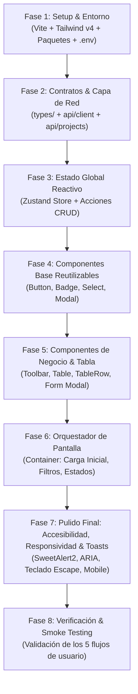
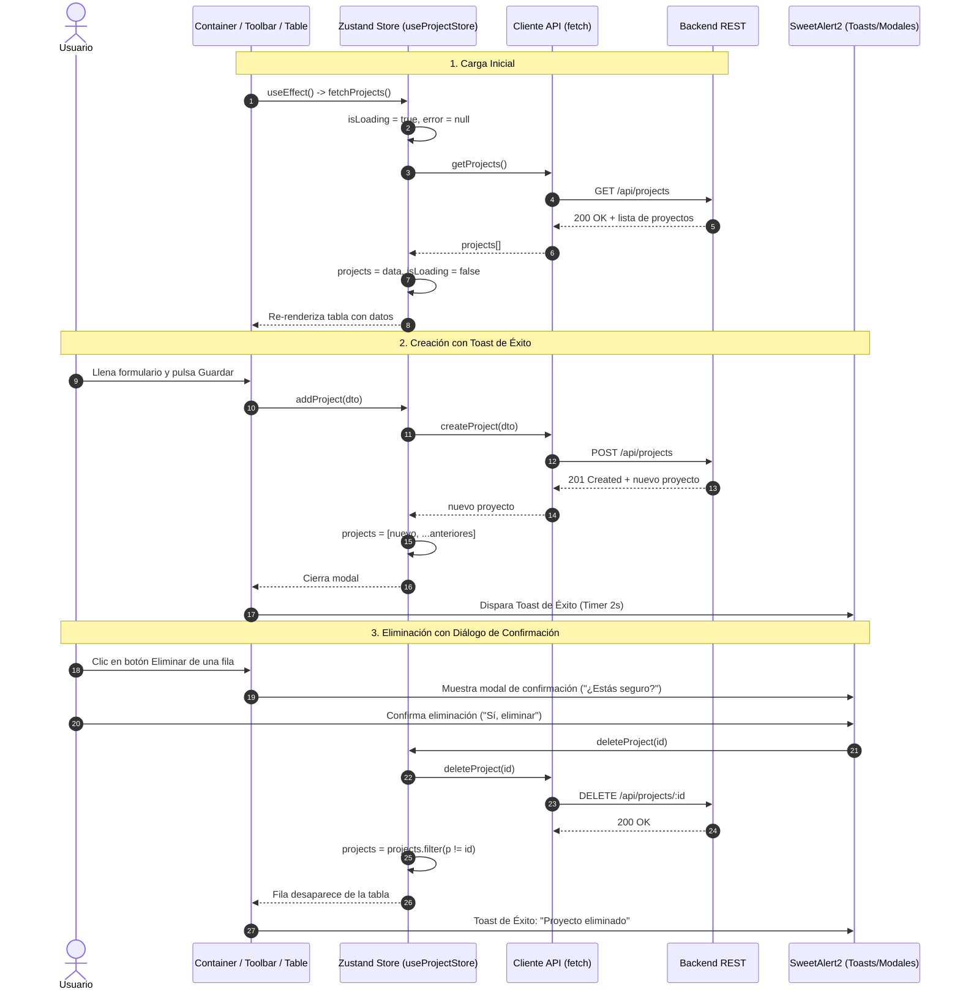
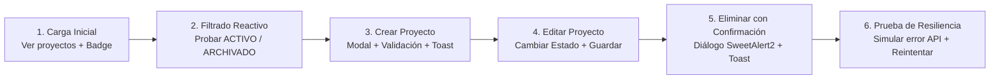

# Guía Maestra: Construcción de Frontend SPA en 30 Minutos (Sin IA y Sin Código)

**Proyecto:** TaskFlow TI — Panel de Gestión de Proyectos y Portafolios  
**Tecnologías:** React 19 + TypeScript + Tailwind CSS v4 + Zustand + Lucide Icons + SweetAlert2  
**Enfoque:** Preparación para Pruebas Técnicas en Vivo / Speedrun de Frontend  
**Duración Objetivo:** 30 minutos estrictos  
**Metodología:** Cero fragmentos de código fuente (TSX/CSS/JS). El documento expone directrices de arquitectura, diagramas de flujo conceptuales, matrices de estados reactivos, algoritmos en lenguaje natural y checklists operativas para desarrollar la interfaz completa con total autonomía.

---

## 1. Estructura de Carpetas Optimizada

Para completar un frontend interactivo, tipado y accesible en 30 minutos, la estructura debe evitar anidamientos profundos y separar de forma tajante la lógica de red/estado de los componentes visuales:

```text
frontend/
├── src/
│   ├── types/              # Contratos de TypeScript y DTOs sincronizados con el backend
│   ├── api/                # Cliente HTTP genérico (fetch) y funciones por recurso
│   ├── stores/             # Gestor de estado global con Zustand y lógica asíncrona
│   ├── components/
│   │   ├── common/         # Componentes base reutilizables (Badge, Button, Modal, Select, Navbar, Footer)
│   │   ├── projects/       # Componentes del módulo de proyectos (Table, Row, Toolbar, Modal, EmptyState)
│   │   └── layout/         # Contenedor principal que orquesta la vista (Container)
│   ├── App.tsx             # Componente raíz de la aplicación
│   ├── main.tsx            # Punto de entrada y montaje en el DOM con React 19
│   └── index.css           # Estilos globales y directivas de Tailwind CSS v4
├── package.json            # Dependencias y scripts de desarrollo
├── vite.config.ts          # Configuración del empaquetador con plugins de React y Tailwind
└── .env                    # Variables de entorno locales (URL de la API)
```

### Matriz de Responsabilidades y Capas

| Capa / Directorio | Responsabilidad Principal | Optimización para los 30 Minutos |
| :--- | :--- | :--- |
| **`types/`** | Centralizar interfaces (`Project`, `ProjectMetrics`, DTOs) y tipos de estado (`ProjectStatus`). | Provee autocompletado en IDE y previene errores de propiedades inexistentes en los componentes. |
| **`api/`** | `client.ts` encapsula `fetch`, encabezados y captura de errores. `projects.api.ts` define los 5 endpoints. | Desacopla la red de los componentes; ninguna vista realiza llamadas `fetch` directamente. |
| **`stores/`** | `useProjectStore.ts` centraliza la lista de proyectos, estados de carga, errores y acciones CRUD. | Elimina por completo el paso de propiedades (prop drilling) entre la tabla, la barra de filtros y los modales. |
| **`components/common/`** | Elementos visuales reutilizables con accesibilidad nativa (botones con loading, modales accesibles, selects). | Evita reescribir estilos y estructuras accesibles cada vez que se requiere un botón o un campo. |
| **`components/projects/`** | Vistas especializadas: tabla de datos, fila individual, barra de herramientas y formulario modal. | Mantiene cada archivo pequeño y enfocado en una única tarea visual o de interacción. |
| **`components/layout/`** | `Container.tsx` conecta el almacén de Zustand con los componentes visuales y SweetAlert2. | Concentra la orquestación del flujo de usuario (abrir modal, confirmar borrado, filtrar, reintentar). |

---

## 2. Modelo Mental y Flujo de Construcción Frontend

### 2.1. ¿Por qué iniciar por la API y finalizar en UI/Accesibilidad/Toasts?

Construir una interfaz de usuario sin datos definidos conduce a rediseños constantes. La estrategia óptima para una prueba de 30 minutos es el **flujo Data-First**:



**Beneficios de esta secuencia:**
1. **La verdad del dato manda:** Una vez que el cliente API y el store de Zustand funcionan, cualquier componente puede conectarse de inmediato y mostrar datos reales.
2. **Desarrollo sin bloqueos:** Los componentes se diseñan sabiendo exactamente qué campos reciben (sin suposiciones).
3. **Pulido sin riesgo:** La accesibilidad, la responsividad y los toasts se añaden sobre una estructura ya funcional, garantizando que el núcleo de la aplicación funcione desde antes del minuto 25.

---

### 2.2. Flujo Reactivo de Datos y Estados en la Aplicación

El siguiente diagrama ilustra cómo fluyen los datos y eventos entre el servidor, el almacén de estado y los componentes de la interfaz:



---

## 3. Cronograma Timeboxing Estricto (30 Minutos)

| Bloque | Minutos | Objetivo Principal | Entregables Clave |
| :---: | :---: | :--- | :--- |
| **1** | **00:00 - 04:00** | Setup de Vite, Tailwind CSS v4, dependencias y `.env` | `package.json`, `vite.config.ts`, `index.css`, `.env` |
| **2** | **04:00 - 08:00** | Modelado de tipos e infraestructura de consumo API | `types/project.types.ts`, `api/client.ts`, `api/projects.api.ts` |
| **3** | **08:00 - 12:00** | Almacén global reactivo con Zustand | `stores/useProjectStore.ts` (CRUD y manejo de errores) |
| **4** | **12:00 - 17:00** | Componentes base reutilizables (UI Atoms accesibles) | `Button.tsx`, `Badge.tsx`, `Select.tsx`, `Modal.tsx`, `Navbar.tsx`, `Footer.tsx` |
| **5** | **17:00 - 22:00** | Componentes del módulo de proyectos | `ProjectToolbar.tsx`, `ProjectTable.tsx`, `ProjectTableRow.tsx`, `ProjectModal.tsx`, `ProjectEmptyState.tsx` |
| **6** | **22:00 - 25:00** | Orquestador principal (`Container.tsx`) y montaje en `App.tsx` | `Container.tsx`, `App.tsx` |
| **7** | **25:00 - 28:00** | Pulido de UI, Accesibilidad (ARIA), Responsividad y Toasts | Confirmaciones SweetAlert2, navegación de teclado, diseño móvil |
| **8** | **28:00 - 30:00** | Smoke Testing y verificación integral del flujo | Validación en vivo de los 5 flujos CRUD y filtros |

---

## 4. Paso a Paso Detallado por Etapa (Sin Código)

### Bloque 1 [00:00 - 04:00]: Setup Rápido, Dependencias y Tailwind CSS v4

#### Paso 1.1: Inicialización del Proyecto y Paquetes
1. Abrir la terminal en el directorio del frontend.
2. Si no está creado, inicializar con la plantilla de Vite para React y TypeScript.
3. Instalar las dependencias fundamentales de producción:
   - Framework reactivo (`react`, `react-dom` en versión 19).
   - Motor de estilos utilitarios (`tailwindcss` y su plugin de integración `@tailwindcss/vite` para Tailwind v4).
   - Gestor de estado global ultraliviano (`zustand`).
   - Colección de iconos vectoriales accesibles (`lucide-react`).
   - Sistema de modales y alertas enriquecidas (`sweetalert2`).
4. Configurar el archivo de empaquetado de Vite (`vite.config.ts`):
   - Registrar el plugin de React.
   - Registrar el plugin oficial de Tailwind CSS para Vite.

#### Paso 1.2: Estilos Globales y Variable de Entorno
1. En el archivo de estilos globales (`src/index.css`):
   - Reemplazar cualquier regla previa con la directiva única de importación de Tailwind v4 (`@import "tailwindcss";`).
   - Añadir comportamiento de desplazamiento suave (`scroll-behavior: smooth`) y eliminación de márgenes predeterminados en el cuerpo.
2. Crear el archivo `.env` en la raíz del frontend:
   - Definir la variable de entorno con el prefijo de Vite (`VITE_API_URL`) apuntando a la URL base del backend (por ejemplo: `http://localhost:3000/api`).

---

### Bloque 2 [04:00 - 08:00]: Contratos de Tipos y Consumo de la API

Iniciamos directamente con el consumo de la API para establecer la capa de datos antes de construir cualquier elemento visual.

#### Paso 2.1: Definición de Tipos del Dominio (`src/types/project.types.ts`)
1. Declarar el tipo literal para los estados válidos de un proyecto: estrictamente `"ACTIVO"` o `"ARCHIVADO"`.
2. Declarar la lista constante de opciones de estado (con valores en mayúsculas y etiquetas legibles en español) para alimentar los selectores de la interfaz.
3. Declarar la interfaz principal `Project` que refleje la respuesta del backend:
   - Identificador UUID (`id`: cadena).
   - Nombre del proyecto (`name`: cadena).
   - Descripción (`description`: cadena o nulo).
   - Estado (`status`: tipo literal anterior).
   - Marcas de tiempo de creación y actualización (`created_at`, `updated_at`: cadenas en formato ISO).
4. Declarar el DTO de creación (`CreateProjectDTO`): nombre obligatorio y descripción opcional.
5. Declarar el DTO de actualización parcial (`UpdateProjectDTO`): nombre, descripción y estado opcionales.
6. Declarar la interfaz de métricas (`ProjectMetrics`): identificador, nombre, totales de tareas (completadas, en proceso, pendientes) y porcentaje numérico de avance.

#### Paso 2.2: Cliente HTTP Genérico (`src/api/client.ts`)
1. Leer la URL base desde las variables de entorno de Vite.
2. Declarar la interfaz genérica de respuesta estándar de la API (`ApiResponse<T>`):
   - Indicador booleano de éxito (`success`).
   - Carga útil opcional (`data` de tipo genérico `T`).
   - Mensaje opcional devuelto por el servidor (`message`).
   - Desglose opcional de errores de validación de campos.
3. Construir y exportar una función asíncrona genérica de cliente (`apiClient<T>`):
   - Recibir la ruta relativa del endpoint y las opciones de configuración de la petición (`RequestInit`).
   - Concatenar la URL base con el endpoint.
   - Establecer el encabezado de tipo de contenido JSON por defecto (`Content-Type: application/json`), combinándolo con cualquier encabezado personalizado.
   - Ejecutar la petición mediante la función nativa `fetch`.
   - Parsear la respuesta a formato JSON estructurado.
   - **Manejo Centralizado de Errores de Red:** Si la respuesta HTTP no es exitosa o el indicador de éxito es falso, extraer el mensaje de error provisto por el backend (o un mensaje de respaldo) y lanzar una excepción nativa (`throw new Error(...)`).
   - Si la respuesta es exitosa, retornar la propiedad de datos (`data`) debidamente tipada como `T`.

#### Paso 2.3: Módulo de Peticiones del Dominio (`src/api/projects.api.ts`)
Construir y exportar las 5 funciones que consumen directamente los endpoints REST utilizando el cliente genérico:
1. `getProjects`: Invoca `GET /projects` y retorna el listado de proyectos.
2. `getProjectMetrics`: Invoca `GET /projects/:id/metrics` recibiendo el UUID y retorna las métricas.
3. `createProject`: Invoca `POST /projects` enviando en el cuerpo el DTO serializado en JSON y retorna el proyecto creado.
4. `updateProject`: Invoca `PATCH /projects/:id` enviando el identificador y el DTO parcial en JSON y retorna el proyecto actualizado.
5. `deleteProject`: Invoca `DELETE /projects/:id` enviando el UUID y retorna el mensaje de confirmación del servidor.

---

### Bloque 3 [08:00 - 12:00]: Gestión de Estado Global Reactivo (Zustand)

Implementar el almacén centralizado (`src/stores/useProjectStore.ts`) para sincronizar el estado del backend con la memoria del cliente.

#### Paso 3.1: Definición de la Interfaz del Almacén
1. Definir la forma del estado:
   - Colección de proyectos (`projects`: arreglo de proyectos, inicialmente vacío).
   - Bandera de carga (`isLoading`: booleano, inicialmente falso).
   - Mensaje de error (`error`: cadena o nulo, inicialmente nulo).
2. Declarar las firmas de las acciones asíncronas:
   - `fetchProjects`: Sin parámetros, carga la lista inicial.
   - `addProject`: Recibe el DTO de creación, guarda en el backend e inserta en el estado.
   - `updateProject`: Recibe el identificador y el DTO parcial, actualiza en el backend y reemplaza en el estado.
   - `deleteProject`: Recibe el identificador, elimina en el backend y retira del estado.

#### Paso 3.2: Implementación de Acciones Asíncronas
1. **Acción `fetchProjects`:**
   - Activar la bandera de carga (`isLoading = true`) y limpiar cualquier error previo.
   - Invocar la función de obtención de proyectos del módulo API en un bloque seguro.
   - Al recibir los datos, guardarlos en el estado y desactivar la bandera de carga.
   - En caso de captura de error, extraer el mensaje, asignarlo a la variable de error y desactivar la carga.
2. **Acción `addProject`:**
   - Activar la carga y limpiar errores.
   - Invocar la creación en el módulo API pasando el DTO.
   - **Inserción Inmediata:** Añadir el proyecto recién creado al inicio del arreglo de proyectos existente (manteniendo el orden cronológico descendente) y desactivar la carga.
   - Si falla, registrar el error en el estado y propagar la excepción para que el modal la capture.
3. **Acción `updateProject`:**
   - Invocar la actualización en el módulo API pasando el identificador y los datos.
   - Al recibir la entidad actualizada, transformar el arreglo de proyectos mapeando cada elemento: si el identificador coincide con el editado, reemplazarlo con el nuevo; en caso contrario, conservarlo idéntico.
   - Si falla, registrar el error y propagar la excepción.
4. **Acción `deleteProject`:**
   - Invocar la eliminación en el módulo API con el identificador.
   - Filtrar el arreglo de proyectos en el estado para excluir el proyecto cuyo identificador coincida con el eliminado.
   - Si falla, registrar el error y propagar la excepción.

---

### Bloque 4 [12:00 - 17:00]: Componentes Base Reutilizables (UI Atoms)

Construir componentes atómicos accesibles y estilizados con Tailwind CSS en `src/components/common/`:

#### Paso 4.1: Componente de Insignia de Estado (`Badge.tsx`)
1. Diseñar un componente para mostrar el estado de los proyectos con estilo de píldora redondeada.
2. Mapear variantes de color semánticas:
   - Estado `"activo"` -> Fondo esmeralda suave, texto esmeralda oscuro, borde esmeralda.
   - Estado `"archivado"` -> Fondo piedra/gris neutro suave, texto piedra oscuro, borde piedra.
3. Incorporar accesibilidad nativa mediante el atributo de rol (`role="status"`) y una etiqueta accesible (`aria-label`) que comunique a los lectores de pantalla el estado exacto.

#### Paso 4.2: Componente de Botón Accesible (`Button.tsx`)
1. Diseñar un botón versátil con soporte para variantes visuales (`default` azul institucional, `ghost` transparente con hover sutil, `destructive` rojo de peligro).
2. Soportar diferentes tamaños (`sm`, `md`, `lg`) y la inyección opcional de iconos de Lucide.
3. Incorporar estado de carga (`isLoading`):
   - Cuando esté cargando, deshabilitar el botón automáticamente.
   - Mostrar una animación de giro mediante el icono `Loader2` de Lucide.
   - Aplicar el atributo `aria-busy="true"` para tecnología de asistencia.
4. Garantizar anillos de enfoque accesibles (`focus-visible:ring-2`) para la navegación exclusiva con teclado.

#### Paso 4.3: Componente de Cuadro Desplegable Accesible (`Select.tsx`)
1. Diseñar un selector de formulario estilizado que acepte un arreglo genérico de opciones con valor y etiqueta.
2. Renderizar un icono de flecha hacia abajo (`ChevronDown`) posicionado absolutamente en el extremo derecho sin interferir con el clic del mouse.
3. Soportar etiqueta textual superior vinculada semánticamente al campo mediante el atributo `htmlFor` e `id` coincidentes.
4. Añadir estilos de foco de alto contraste y estados deshabilitados con cursor restringido.

#### Paso 4.4: Componente de Ventana Modal Accesible (`Modal.tsx`)
1. Diseñar un contenedor superpuesto (Backdrop) en pantalla completa con fondo semitransparente oscuro (`fixed inset-0 bg-black/50`).
2. Configurar la ventana central con ancho máximo adaptable, fondo blanco, esquinas redondeadas y sombra prominente.
3. **Mapeo de Accesibilidad para Diálogos (WAI-ARIA):**
   - Asignar el rol de diálogo modal (`role="dialog"` y `aria-modal="true"`).
   - Vincular el título del modal con el contenedor mediante `aria-labelledby`.
   - Incluir un botón de cierre con icono de equis (`X`) con etiqueta accesible explícita (`aria-label="Cerrar modal"`).
4. **Control de Teclado y Cierre:**
   - Registrar un escuchador de teclado en la ventana global para cerrar el modal automáticamente cuando el usuario presione la tecla `Escape`.
   - Permitir el cierre al hacer clic fuera del contenido del modal (en el backdrop).

#### Paso 4.5: Barra de Navegación y Pie de Página (`Navbar.tsx` y `Footer.tsx`)
1. En `Navbar`: Diseñar un encabezado semántico (`<header>`) con el título del producto (`TaskFlow TI`) en tipografía destacada y una breve descripción subtitulada.
2. En `Footer`: Diseñar un pie de página semántico (`<footer>`) con texto centrado y el año dinámico de derechos reservados.

---

### Bloque 5 [17:00 - 22:00]: Componentes de Negocio y Tabla de Proyectos

Crear los componentes específicos de la funcionalidad en `src/components/projects/`:

#### Paso 5.1: Barra de Herramientas y Filtro (`ProjectToolbar.tsx`)
1. Diseñar una barra horizontal superior que en pantallas pequeñas se apile verticalmente (`flex flex-col sm:flex-row`).
2. Colocar en la sección izquierda un grupo de filtro que incluya la etiqueta "Filtrar por estado:" y el componente `Select` con las opciones: `"TODOS"`, `"ACTIVO"` y `"ARCHIVADO"`.
3. Colocar en la sección derecha el botón principal de acción con icono de suma (`Plus`) y etiqueta "Agregar proyecto", conectado al manejador de apertura del modal de creación.

#### Paso 5.2: Fila de la Tabla (`ProjectTableRow.tsx`)
1. Renderizar una fila (`<tr>`) con efecto de resalte sutil al posar el cursor (`hover:bg-stone-50`).
2. Diseñar las 4 celdas de datos:
   - **Nombre:** Texto en negrita con tipografía oscura.
   - **Descripción:** Texto truncado con límite de ancho para evitar deformar la tabla, mostrando un texto en cursiva atenuada ("Sin descripción") si el campo es nulo o vacío.
   - **Estado:** Componente `Badge` que renderiza la píldora correspondiente.
   - **Acciones:** Menú alineado a la derecha con dos botones pequeños:
     - Botón "Editar" (variante ghost, icono `Pencil`, etiqueta accesible descriptiva que incluya el nombre del proyecto).
     - Botón "Eliminar" (variante destructive, icono `Trash`, etiqueta accesible descriptiva).

#### Paso 5.3: Tabla de Proyectos y Estados de Carga (`ProjectTable.tsx`)
1. Envolver la tabla en un contenedor con borde, esquinas redondeadas y habilitación de desplazamiento horizontal para móviles (`overflow-x-auto min-w-150`).
2. Diseñar la cabecera de la tabla con etiquetas semánticas (`scope="col"`) para Nombre, Descripción, Estado y Acciones.
3. **Manejo de Estados de la Tabla:**
   - **Estado de Carga:** Si la bandera de carga está activa y la lista está vacía, renderizar una fila que abarque las 4 columnas con un indicador de "Cargando proyectos...".
   - **Estado Vacío:** Si la lista resultante es cero, renderizar una fila con el componente `ProjectEmptyState`.
   - **Estado con Datos:** Mapear el arreglo de proyectos renderizando una fila `ProjectTableRow` por cada elemento con su clave única (`key={project.id}`).

#### Paso 5.4: Estado Vacío Contextual (`ProjectEmptyState.tsx`)
1. Diseñar una vista centrada con icono temático (`FolderKanban`), título y descripción explicativa.
2. Adaptar el mensaje de forma reactiva:
   - Si hay un filtro activo (ej. "ARCHIVADO"): Informar que no hay proyectos con dicho estado y sugerir cambiar el filtro.
   - Si no hay proyectos en absoluto: Informar que aún no existen registros e invitar al usuario a crear el primero mediante un botón directo.

#### Paso 5.5: Formulario y Modal de Proyecto (`ProjectModal.tsx`)
1. Diseñar el formulario reactivo interno (`ProjectForm`):
   - Inicializar el estado local para `name`, `description` y `status`, prellenándolos si se recibe un proyecto a editar o inicializándolos vacíos si es creación.
   - Mantener una bandera de envío en curso (`isSubmitting`) y una cadena de mensaje de error local.
2. **Validación en Cliente al Enviar (`handleSubmit`):**
   - Prevenir la recarga de página nativa (`e.preventDefault()`).
   - Validar que el nombre no esté en blanco tras recortar espacios (trim); si está vacío, mostrar mensaje de error.
   - Validar longitud mínima de 3 caracteres.
3. **Lógica de Envío Diferenciada:**
   - Si está editando: Invocar `updateProject` del almacén pasando el ID y los datos modificados. Al resolver, cerrar el modal y disparar un toast de éxito con SweetAlert2.
   - Si está creando: Invocar `addProject` del almacén pasando nombre y descripción. Al resolver, cerrar el modal y disparar el toast de éxito.
   - En caso de error: Atrapar la excepción del backend (ej. "Ya existe un proyecto con ese nombre"), desplegarla en el formulario y lanzar una alerta visual de error con SweetAlert2.
4. **Campos del Formulario:**
   - Campo de texto para Nombre con requerimiento HTML5, longitud mínima 3 y máxima 80.
   - Área de texto para Descripción con máximo de 500 caracteres y 3 filas visibles.
   - Campo selector de Estado (visible exclusivamente cuando se encuentre en modo de edición).
   - Botones de acción: "Cancelar" (cierra sin guardar) y "Guardar" / "Actualizar" (con indicador de carga si está enviando).

---

### Bloque 6 [22:00 - 25:00]: Orquestador Principal y Montaje en App

Conectar todas las piezas dentro de `src/components/layout/Container.tsx`:

#### Paso 6.1: Orquestador de Pantalla (`Container.tsx`)
1. Declarar los estados locales de control de interfaz:
   - Bandera de visibilidad del modal (`isModalOpen`).
   - Proyecto seleccionado para edición (`selectedProject`: proyecto o nulo).
   - Filtro de estado activo (`filterStatus`: `"TODOS"`, `"ACTIVO"` o `"ARCHIVADO"`).
2. Extraer del almacén de Zustand (`useProjectStore`): `projects`, `isLoading`, `error`, `fetchProjects` y `deleteProject`.
3. **Efecto de Carga Inicial:**
   - Configurar un efecto de React (`useEffect`) que ejecute `fetchProjects()` al montarse el componente.
4. **Manejadores de Interacción:**
   - `handleOpenCreateModal`: Establece el proyecto seleccionado en nulo y abre el modal.
   - `handleOpenEditModal`: Recibe el proyecto de la fila, lo asigna al estado y abre el modal.
   - `handleCloseModal`: Cierra el modal y limpia el proyecto seleccionado.
   - `handleDeleteProject`: Recibe el ID y el nombre del proyecto; dispara el diálogo modal de confirmación crítica de SweetAlert2 (ver Bloque 7).
5. **Cálculo Derivado de Proyectos Filtrados:**
   - Computar en memoria la lista filtrada: si el filtro es `"TODOS"`, devolver el arreglo íntegro; en caso contrario, filtrar los proyectos cuyo estado coincida exactamente con la opción seleccionada.
6. **Estructura Visual del Retorno:**
   - Contenedor centrado con ancho máximo (`max-w-7xl mx-auto`), relleno responsivo y separación vertical homogénea.
   - Renderizar `Navbar`.
   - Renderizar la barra `ProjectToolbar` conectando el filtro y el botón de creación.
   - Si la variable `error` del almacén contiene un mensaje, renderizar una alerta destacada en rojo con rol de alerta (`role="alert"`) y un botón de "Reintentar" que vuelva a ejecutar `fetchProjects()`.
   - Renderizar `ProjectTable` pasando la lista filtrada, el estado de carga y los manejadores de edición/eliminación.
   - Renderizar `ProjectModal` controlado por el estado de visibilidad y el proyecto a editar.
   - Renderizar `Footer`.

#### Paso 6.2: Montaje en Raíz (`App.tsx` y `main.tsx`)
1. En `src/App.tsx`: Importar el componente `Container` y retornarlo envuelto en un fragmento de React.
2. En `src/main.tsx`: Verificar que la raíz de React 19 monte el componente `App` dentro del modo estricto (`StrictMode`) e importe la hoja de estilos global (`index.css`).

---

### Bloque 7 [25:00 - 28:00]: Pulido de UI, Accesibilidad, Responsividad y Toasts

Esta etapa eleva la calidad técnica del proyecto a estándares de producción en pocos minutos.

#### Paso 7.1: Sistema de Toasts y Alertas con SweetAlert2
1. **Diálogo de Confirmación de Eliminación:**
   - En el manejador de borrado de `Container.tsx`, invocar `Swal.fire` con icono de advertencia (`warning`).
   - Mostrar título "¿Estás seguro?" y texto dinámico indicando que el proyecto específico será eliminado de forma permanente.
   - Habilitar botón de cancelación y botón de confirmación en rojo destructivo ("Sí, eliminar").
   - Invertir el orden de los botones para colocar la acción segura a la derecha.
   - Si el usuario confirma: Ejecutar la llamada asíncrona a `deleteProject(id)`. Al completar, disparar un toast de éxito (`icon: "success"`) con temporizador automático de 2 segundos sin requerir confirmación manual.
   - Si la eliminación falla: Atrapar el error y mostrar un modal de error (`icon: "error"`) con el mensaje devuelto por el servidor.
2. **Toasts de Éxito en Creación y Edición:**
   - En el formulario modal, tras recibir respuesta exitosa del almacén, disparar `Swal.fire` con temporizador de 2000 ms, icono de éxito y texto celebrando la creación o actualización limpia.

#### Paso 7.2: Checklist de Accesibilidad (WAI-ARIA y Teclado)
1. **Etiquetas Accesibles en Iconos:** Verificar que todos los botones que contienen iconos sin texto visible (o con texto secundario) cuenten con un atributo `aria-label` descriptivo (ej. "Editar proyecto Sistema de Facturación").
2. **Roles de Diálogo:** Confirmar que el componente `Modal` posea `role="dialog"`, `aria-modal="true"` y esté vinculado a su título mediante `aria-labelledby`.
3. **Manejo de Foco y Escape:** Comprobar que al abrir el modal se pueda pulsar la tecla `Escape` para abandonarlo inmediatamente y que ningún elemento pierda su anillo visual de enfoque al tabular (`focus-visible:ring-2`).
4. **Mensajes Vivos y Alertas:** Asegurar que los mensajes de error en formularios y en la pantalla principal utilicen `role="alert"` para que los lectores de pantalla los anuncien en cuanto aparezcan.

#### Paso 7.3: Verificación de Responsividad con Tailwind CSS
1. **Diseño Adaptable en Dispositivos Móviles:**
   - Comprobar que en pantallas estrechas (`< 640px`) la barra de herramientas apile el selector de filtro y el botón de creación verticalmente mediante `flex-col sm:flex-row`.
   - Comprobar que la tabla se mantenga legible en pantallas móviles gracias al contenedor con desplazamiento horizontal (`overflow-x-auto`) sin desbordar el layout de la página.
   - Comprobar que el modal limite su ancho en móviles con márgenes seguros (`p-4` en el backdrop y `max-w-md` en la tarjeta).

---

### Bloque 8 [28:00 - 30:00]: Protocolo de Smoke Testing Frontend (2 Minutos)

Ejecutar la siguiente secuencia de pruebas manuales en el navegador con el backend activo para validar que el 100% de los requerimientos están satisfechos:



#### Checklist de Comprobación Rápida:
1. **Verificación de Carga Inicial:**
   - Abrir la aplicación en el navegador (`npm run dev`).
   - Comprobar que se muestre brevemente el indicador de carga y luego aparezca la lista de proyectos con sus estados en insignias de color.
2. **Verificación del Filtro de Estados:**
   - Cambiar el selector de la barra a "Archivado": Verificar que solo permanezcan los proyectos archivados.
   - Cambiar a "Activo": Verificar que solo aparezcan los proyectos activos.
   - Si una categoría no tiene proyectos, verificar que se dibuje la pantalla de estado vacío con el mensaje adecuado.
   - Regresar el filtro a "Todos los estados".
3. **Verificación de Creación:**
   - Pulsar "Agregar proyecto": Verificar que el modal se abra y tome el foco.
   - Intentar guardar con el campo vacío: Verificar que el formulario impida el envío y marque error.
   - Escribir un nombre válido y descripción; pulsar Guardar.
   - Verificar que el modal se cierre, aparezca el toast verde de SweetAlert2 y el nuevo proyecto figure en la primera posición de la tabla.
4. **Verificación de Edición:**
   - Pulsar el botón "Editar" del proyecto recién creado.
   - Cambiar el estado a "Archivado" y modificar la descripción.
   - Pulsar Actualizar: Verificar el toast de éxito y que la insignia del proyecto cambie inmediatamente a color neutro de archivado.
5. **Verificación de Eliminación:**
   - Pulsar el botón "Eliminar" de una fila.
   - Verificar que aparezca el diálogo de advertencia de SweetAlert2 con el botón rojo de confirmación.
   - Pulsar "Cancelar": Comprobar que el proyecto permanezca intacto.
   - Pulsar nuevamente "Eliminar" y confirmar con "Sí, eliminar": Comprobar que aparezca el toast de confirmación y la fila desaparezca al instante.
6. **Verificación de Resiliencia y Accesibilidad:**
   - Abrir el modal y presionar la tecla `Escape`: Comprobar que se cierre de inmediato.
   - Apagar temporalmente el backend y pulsar el botón de recarga: Verificar que la aplicación no colapse con pantalla blanca, sino que presente la alerta roja accesible con el botón "Reintentar".

---

## 5. 10 Reglas de Oro para Pruebas Técnicas Frontend

1. **Separa siempre la red de los componentes:** Nunca llames a `fetch` dentro de un componente `onClick` o `useEffect`. Centraliza las llamadas en un archivo de API para poder cambiar contratos o URLs en segundos.
2. **Zustand supera a Context en pruebas rápidas:** Para aplicaciones de prueba en vivo, Zustand no requiere proveedores (`Providers`), no sufre de re-renders innecesarios y se configura en 10 líneas.
3. **No olvides el `preventDefault` en formularios:** Si omites `e.preventDefault()` en el manejador del formulario, el navegador recargará la página por completo, perdiendo el estado reactivo.
4. **Usa siempre claves estables (`key`):** Al mapear listas con `.map()`, utiliza siempre el identificador único (`project.id`) y jamás el índice del arreglo para evitar bugs visuales al eliminar elementos.
5. **Inyecta valores por defecto al editar:** Para evitar advertencias de React sobre componentes pasando de no controlados a controlados, asigna siempre cadenas vacías como respaldo (`project?.name ?? ""`).
6. **Protege la accesibilidad con etiquetas en botones de solo icono:** Un botón con solo un icono de lápiz o basura es invisible para lectores de pantalla; añade siempre `aria-label="Editar proyecto [nombre]"`.
7. **El toast debe ser no bloqueante:** Emplea temporizadores cortos (1.5 a 2 segundos) y elimina botones de confirmación en los toasts de éxito para que el usuario no tenga que hacer clics extras.
8. **Muestra estados de carga y deshabilita botones:** Durante peticiones asíncronas de guardado o borrado, deshabilita los botones de acción para prevenir dobles envíos accidentales.
9. **Garantiza desplazamiento horizontal en tablas:** Las tablas HTML rompen el diseño móvil si no se envuelven en un contenedor con `overflow-x-auto`. Añade esta regla siempre por defecto.
10. **Diseña el estado de error con opción de reintento:** Un evaluador técnico valora enormemente que la interfaz maneje fallos de red con un mensaje claro y un botón para reintentar la operación sin recargar toda la página.
