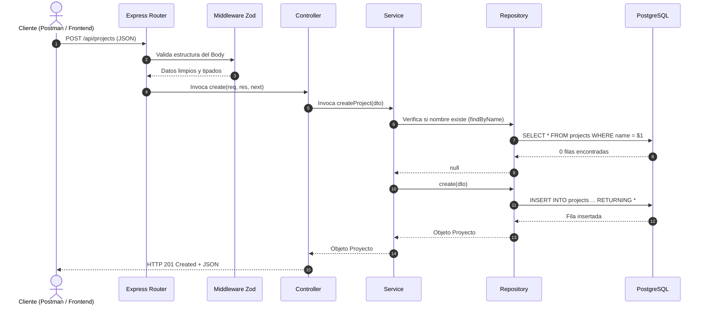
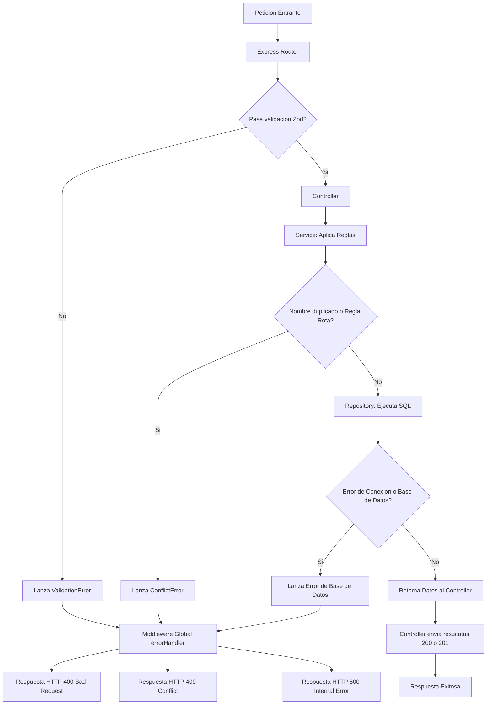

# Guia de Implementacion Paso a Paso del Backend (Node.js + Express + TypeScript + PostgreSQL)

**Proyecto:** TaskFlow TI - API REST  
**Objetivo:** Guiar la construccion del backend desde cero, explicando que hace cada archivo, por que se estructura de esta forma, como fluyen los datos entre capas y como verificar cada avance con Postman.

---

## Indice de Contenidos
1. [Modelo Mental: El Ciclo de Vida de una Peticion HTTP](#1-modelo-mental-el-ciclo-de-vida-de-una-peticion-http)
2. [Estructura del Proyecto y Responsabilidad de Cada Capa](#2-estructura-del-proyecto-y-responsabilidad-de-cada-capa)
3. [Fase 1: Inicializacion del Entorno y Configuracion de TypeScript](#3-fase-1-inicializacion-del-entorno-y-configuracion-de-typescript)
4. [Fase 2: Conexion a PostgreSQL y Variables de Entorno](#4-fase-2-conexion-a-postgresql-y-variables-de-entorno)
5. [Fase 3: Definicion de Tipos e Interfaces con TypeScript](#5-fase-3-definicion-de-tipos-e-interfaces-con-typescript)
6. [Fase 4: Capa Repository (Acceso a Datos y SQL Puro)](#6-fase-4-capa-repository-acceso-a-datos-y-sql-puro)
7. [Fase 5: Capa Service y Manejo de Errores del Negocio](#7-fase-5-capa-service-y-manejo-de-errores-del-negocio)
8. [Fase 6: Validaciones con Zod y Middlewares Globales](#8-fase-6-validaciones-con-zod-y-middlewares-globales)
9. [Fase 7: Capa Controller (Protocolo HTTP)](#9-fase-7-capa-controller-protocolo-http)
10. [Fase 8: Enrutamiento y Punto de Entrada del Servidor](#10-fase-8-enrutamiento-y-punto-de-entrada-del-servidor)
11. [Fase 9: Pruebas con Postman Paso a Paso](#11-fase-9-pruebas-con-postman-paso-a-paso)
12. [Fase 10: Pruebas de Integracion con Supertest](#12-fase-10-pruebas-de-integracion-con-supertest)
13. [Guia de Resolucion de Problemas Comunes (Troubleshooting)](#13-guia-de-resolucion-de-problemas-comunes-troubleshooting)

---

## 1. Modelo Mental: El Ciclo de Vida de una Peticion HTTP

Antes de escribir codigo, es fundamental entender que cada peticion sigue un recorrido estricto y unidireccional. Cada componente tiene una unica mision.

### Diagrama de Flujo: Peticion Exitosa (Happy Path)



### Diagrama de Flujo: Manejo de Excepciones y Errores



---

## 2. Estructura del Proyecto y Responsabilidad de Cada Capa

Para mantener el codigo ordenado y facilitar su evaluacion tecnica, organizaremos el backend siguiendo el patron en 3 capas:

```text
backend/
├── src/
│   ├── config/             # Configuracion de entorno y conexion a base de datos
│   │   ├── env.ts
│   │   └── database.ts
│   ├── types/              # Interfaces TypeScript y DTOs
│   │   ├── project.types.ts
│   │   └── task.types.ts
│   ├── errors/             # Clases de error personalizadas con codigos HTTP
│   │   └── appErrors.ts
│   ├── schemas/            # Validacion de esquemas con Zod
│   │   ├── project.schema.ts
│   │   └── task.schema.ts
│   ├── middlewares/        # Middlewares de validacion y captura de errores
│   │   ├── validate.middleware.ts
│   │   └── errorHandler.middleware.ts
│   ├── repositories/       # Consultas SQL puras a PostgreSQL
│   │   ├── project.repository.ts
│   │   └── task.repository.ts
│   ├── services/           # Reglas de negocio del sistema
│   │   ├── project.service.ts
│   │   └── task.service.ts
│   ├── controllers/        # Controladores HTTP (reciben req, devuelven res)
│   │   ├── project.controller.ts
│   │   └── task.controller.ts
│   ├── routes/             # Definicion de rutas REST
│   │   ├── project.routes.ts
│   │   ├── task.routes.ts
│   │   └── index.ts
│   ├── app.ts              # Configuracion de la aplicacion Express
│   └── server.ts           # Punto de arranque (listen)
├── tests/
│   └── integration/
│       └── projects.test.ts
├── .env
├── .env.example
├── .gitignore
├── package.json
└── tsconfig.json
```

### Tabla de Responsabilidades Unicas

| Capa | Lo que DEBE hacer | Lo que NUNCA debe hacer |
|---|---|---|
| **Repository** | Ejecutar sentencias SQL con `$1, $2`, mapear filas y devolver datos crudos o `null`. | No maneja objetos `req` ni `res`. No valida reglas de negocio complejas. |
| **Service** | Validar reglas del negocio (ej. verificar si un proyecto esta archivado antes de agregar tareas), coordinar transacciones y orquestar llamadas a repositories. | No ejecuta sentencias SQL directamente. No conoce nada sobre HTTP (`res.status`, `res.json`). |
| **Controller** | Extraer datos de la peticion (`req.body`, `req.params`), llamar al service correspondiente y enviar la respuesta HTTP (`res.status(200).json(...)`). | No ejecuta consultas SQL. No valida reglas de negocio profundas. |
| **Middleware** | Interceptar peticiones para validar entradas (Zod), registrar accesos o atrapar errores no controlados. | No debe reemplazar a los servicios en la ejecucion del negocio. |

---

## 3. Fase 1: Inicializacion del Entorno y Configuracion de TypeScript

### Paso 1.1: Crear la estructura de carpetas
Abre tu terminal de PowerShell en la raiz del proyecto (`12-fullstack`) y ejecuta:

```powershell
# Crear carpeta backend y subdirectorios
mkdir -p backend/src/config, backend/src/types, backend/src/errors, backend/src/schemas, backend/src/middlewares, backend/src/repositories, backend/src/services, backend/src/controllers, backend/src/routes, backend/tests/integration
```

### Paso 1.2: Inicializar `package.json` e instalar dependencias

```powershell
cd backend
npm init -y
```

Instalar dependencias de produccion:
```powershell
npm install express pg dotenv cors zod
```

Instalar dependencias de desarrollo y tipos:
```powershell
npm install -D typescript @types/node @types/express @types/pg @types/cors ts-node-dev
```

### Paso 1.3: Configurar `tsconfig.json`
Crea el archivo `backend/tsconfig.json` con la siguiente configuracion:

```json
{
  "compilerOptions": {
    "target": "ES2022",
    "module": "NodeNext",
    "moduleResolution": "NodeNext",
    "lib": ["ES2022"],
    "outDir": "./dist",
    "rootDir": "./src",
    "strict": true,
    "esModuleInterop": true,
    "skipLibCheck": true,
    "forceConsistentCasingInFileNames": true,
    "resolveJsonModule": true
  },
  "include": ["src/**/*"],
  "exclude": ["node_modules", "dist", "tests"]
}
```

### Paso 1.4: Configurar los scripts de ejecucion en `package.json`
Abre `backend/package.json` y actualiza la seccion `"scripts"`:

```json
"scripts": {
  "dev": "ts-node-dev --respawn --transpile-only src/server.ts",
  "build": "tsc",
  "start": "node dist/server.js"
}
```

### Paso 1.5: Configurar `.gitignore`
Crea el archivo `backend/.gitignore`:

```text
node_modules/
dist/
.env
*.log
```

---

## 4. Fase 2: Conexion a PostgreSQL y Variables de Entorno

### Paso 2.1: Crear archivos `.env` y `.env.example`
Crea `backend/.env` con tus credenciales locales (`postgres` / `postgres`):

```env
PORT=3000
NODE_ENV=development

# Configuracion PostgreSQL Local
DB_HOST=localhost
DB_PORT=5432
DB_USER=postgres
DB_PASSWORD=postgres
DB_NAME=taskflow_db
```

Crea `backend/.env.example` como plantilla para el repositorio:

```env
PORT=3000
NODE_ENV=development

DB_HOST=localhost
DB_PORT=5432
DB_USER=postgres
DB_PASSWORD=postgres
DB_NAME=taskflow_db
```

### Paso 2.2: Lectura tipada de variables de entorno (`src/config/env.ts`)
Este archivo centraliza el acceso a `process.env` y provee valores por defecto seguros.

```typescript
// src/config/env.ts
import dotenv from 'dotenv';

dotenv.config();

export const ENV = {
  PORT: Number(process.env.PORT) || 3000,
  NODE_ENV: process.env.NODE_ENV || 'development',
  DB: {
    HOST: process.env.DB_HOST || 'localhost',
    PORT: Number(process.env.DB_PORT) || 5432,
    USER: process.env.DB_USER || 'postgres',
    PASSWORD: process.env.DB_PASSWORD || 'postgres',
    NAME: process.env.DB_NAME || 'taskflow_db',
  },
};
```

### Paso 2.3: Creacion del Pool de Conexiones (`src/config/database.ts`)

```typescript
// src/config/database.ts
import { Pool, QueryResult, QueryResultRow } from 'pg';
import { ENV } from './env.js';

// Un Pool mantiene varias conexiones abiertas y las reutiliza.
// Evita el costo de abrir y cerrar una conexion TCP por cada peticion HTTP.
export const pool = new Pool({
  host: ENV.DB.HOST,
  port: ENV.DB.PORT,
  user: ENV.DB.USER,
  password: ENV.DB.PASSWORD,
  database: ENV.DB.NAME,
  max: 20, // Maximo 20 clientes concurrentes en el pool
  idleTimeoutMillis: 30000,
  connectionTimeoutMillis: 2000,
});

// Evento que confirma la conexion inicial exitosa
pool.on('connect', () => {
  console.log('[Database]: Conexion establecida con el pool de PostgreSQL');
});

pool.on('error', (err) => {
  console.error('[Database Error]: Error inesperado en cliente inactivo del pool', err);
});

// Helper generico para consultas con tipado de retorno
export async function query<T extends QueryResultRow = any>(
  text: string,
  params?: any[]
): Promise<QueryResult<T>> {
  return pool.query<T>(text, params);
}
```

### Paso 2.4: Script de verificacion de conexion inmediata
Crea temporalmente `backend/src/test-db.ts` para verificar la conexion:

```typescript
// src/test-db.ts
import { pool } from './config/database.js';

async function testConnection() {
  try {
    const res = await pool.query('SELECT NOW() AS current_time, current_database() AS db_name;');
    console.log('Conexion exitosa a PostgreSQL:');
    console.log('Base de datos:', res.rows[0].db_name);
    console.log('Hora del servidor:', res.rows[0].current_time);
  } catch (error) {
    console.error('Error conectando a la base de datos:', error);
  } finally {
    await pool.end();
  }
}

testConnection();
```

Ejecuta en tu terminal:
```powershell
npx ts-node-dev src/test-db.ts
```
Si ves el nombre de la base de datos y la hora, la conexion a PostgreSQL esta funcionando y puedes continuar. Luego puedes eliminar o conservar ese archivo.

---

## 5. Fase 3: Definicion de Tipos e Interfaces con TypeScript

Definir las interfaces antes de programar permite que TypeScript valide que todas las capas hablen el mismo idioma.

### Paso 3.1: Tipos para Proyectos (`src/types/project.types.ts`)

```typescript
// src/types/project.types.ts

export type ProjectStatus = 'ACTIVO' | 'ARCHIVADO';

export interface Project {
  id: string;
  name: string;
  description: string | null;
  status: ProjectStatus;
  created_at: Date;
  updated_at: Date;
}

// Data Transfer Object para creacion (lo que envia el cliente)
export interface CreateProjectDTO {
  name: string;
  description?: string;
}

// Data Transfer Object para actualizacion parcial
export interface UpdateProjectDTO {
  name?: string;
  description?: string;
  status?: ProjectStatus;
}

// Informacion agregada de metricas
export interface ProjectMetrics {
  project_id: string;
  project_name: string;
  total_tasks: number;
  completed_tasks: number;
  in_progress_tasks: number;
  pending_tasks: number;
  completion_percentage: number;
}
```

### Paso 3.2: Tipos para Tareas (`src/types/task.types.ts`)

```typescript
// src/types/task.types.ts

export type TaskPriority = 'BAJA' | 'MEDIA' | 'ALTA';
export type TaskStatus = 'PENDIENTE' | 'EN_PROCESO' | 'COMPLETADA';

export interface Task {
  id: string;
  project_id: string;
  title: string;
  description: string | null;
  priority: TaskPriority;
  status: TaskStatus;
  due_date: string | null;
  completed_at: Date | null;
  created_at: Date;
  updated_at: Date;
}

export interface CreateTaskDTO {
  project_id: string;
  title: string;
  description?: string;
  priority?: TaskPriority;
  due_date?: string;
  tag_ids?: string[];
}
```

---

## 6. Fase 4: Capa Repository (Acceso a Datos y SQL Puro)

Esta capa es la unica que escribe sentencias SQL. No conoce nada sobre HTTP (`req`, `res`).

### Paso 4.1: Implementacion de `src/repositories/project.repository.ts`

```typescript
// src/repositories/project.repository.ts
import { query } from '../config/database.js';
import { Project, CreateProjectDTO, UpdateProjectDTO, ProjectMetrics } from '../types/project.types.js';

export class ProjectRepository {
  // 1. Obtener todos los proyectos
  async findAll(): Promise<Project[]> {
    const text = `
      SELECT id, name, description, status, created_at, updated_at
      FROM projects
      ORDER BY created_at DESC;
    `;
    const result = await query<Project>(text);
    return result.rows;
  }

  // 2. Buscar por ID
  async findById(id: string): Promise<Project | null> {
    const text = `
      SELECT id, name, description, status, created_at, updated_at
      FROM projects
      WHERE id = $1;
    `;
    const result = await query<Project>(text, [id]);
    return result.rows[0] || null;
  }

  // 3. Buscar por Nombre (util para validar duplicados antes de insertar)
  async findByName(name: string): Promise<Project | null> {
    const text = `
      SELECT id, name, description, status, created_at, updated_at
      FROM projects
      WHERE LOWER(name) = LOWER($1);
    `;
    const result = await query<Project>(text, [name]);
    return result.rows[0] || null;
  }

  // 4. Crear Proyecto
  async create(data: CreateProjectDTO): Promise<Project> {
    const text = `
      INSERT INTO projects (name, description)
      VALUES ($1, $2)
      RETURNING id, name, description, status, created_at, updated_at;
    `;
    const values = [data.name.trim(), data.description ? data.description.trim() : null];
    const result = await query<Project>(text, values);
    return result.rows[0];
  }

  // 5. Actualizar Proyecto
  async update(id: string, data: UpdateProjectDTO): Promise<Project | null> {
    const text = `
      UPDATE projects
      SET 
        name = COALESCE($1, name),
        description = COALESCE($2, description),
        status = COALESCE($3, status),
        updated_at = CURRENT_TIMESTAMP
      WHERE id = $4
      RETURNING id, name, description, status, created_at, updated_at;
    `;
    const values = [data.name, data.description, data.status, id];
    const result = await query<Project>(text, values);
    return result.rows[0] || null;
  }

  // 6. Consulta Avanzada: Metricas calculadas en PostgreSQL
  async getMetrics(id: string): Promise<ProjectMetrics | null> {
    const text = `
      SELECT 
        p.id AS project_id,
        p.name AS project_name,
        COUNT(t.id)::int AS total_tasks,
        COUNT(CASE WHEN t.status = 'COMPLETADA' THEN 1 END)::int AS completed_tasks,
        COUNT(CASE WHEN t.status = 'EN_PROCESO' THEN 1 END)::int AS in_progress_tasks,
        COUNT(CASE WHEN t.status = 'PENDIENTE' THEN 1 END)::int AS pending_tasks,
        ROUND(
          COALESCE(
            (COUNT(CASE WHEN t.status = 'COMPLETADA' THEN 1 END)::numeric / NULLIF(COUNT(t.id), 0)) * 100,
            0
          ), 1
        )::float AS completion_percentage
      FROM projects p
      LEFT JOIN tasks t ON p.id = t.project_id
      WHERE p.id = $1
      GROUP BY p.id, p.name;
    `;
    const result = await query<ProjectMetrics>(text, [id]);
    return result.rows[0] || null;
  }
}
```

---

## 7. Fase 5: Capa Service y Manejo de Errores del Negocio

### Paso 7.1: Jerarquia de Errores Personalizados (`src/errors/appErrors.ts`)
Permite lanzar errores semanticos en cualquier capa sin acoplarse a Express.

```typescript
// src/errors/appErrors.ts

export abstract class AppError extends Error {
  abstract readonly statusCode: number;

  constructor(message: string) {
    super(message);
    Object.setPrototypeOf(this, new.target.prototype);
  }
}

export class NotFoundError extends AppError {
  readonly statusCode = 404;
  constructor(message: string = 'Recurso no encontrado') {
    super(message);
  }
}

export class BadRequestError extends AppError {
  readonly statusCode = 400;
  constructor(message: string = 'Solicitud invalida') {
    super(message);
  }
}

export class ConflictError extends AppError {
  readonly statusCode = 409;
  constructor(message: string = 'Conflicto de recursos') {
    super(message);
  }
}
```

### Paso 7.2: Implementacion de `src/services/project.service.ts`
El servicio contiene las reglas del negocio:

```typescript
// src/services/project.service.ts
import { ProjectRepository } from '../repositories/project.repository.js';
import { CreateProjectDTO, UpdateProjectDTO, Project, ProjectMetrics } from '../types/project.types.js';
import { ConflictError, NotFoundError } from '../errors/appErrors.js';

export class ProjectService {
  private projectRepo: ProjectRepository;

  constructor() {
    this.projectRepo = new ProjectRepository();
  }

  async getAllProjects(): Promise<Project[]> {
    return this.projectRepo.findAll();
  }

  async getProjectById(id: string): Promise<Project> {
    const project = await this.projectRepo.findById(id);
    if (!project) {
      throw new NotFoundError(`El proyecto con ID ${id} no existe`);
    }
    return project;
  }

  async createProject(data: CreateProjectDTO): Promise<Project> {
    // Regla de Negocio 1: El nombre no puede repetirse
    const existing = await this.projectRepo.findByName(data.name);
    if (existing) {
      throw new ConflictError(`Ya existe un proyecto registrado con el nombre: "${data.name}"`);
    }

    return this.projectRepo.create(data);
  }

  async updateProject(id: string, data: UpdateProjectDTO): Promise<Project> {
    // Verificar existencia previa
    await this.getProjectById(id);

    // Si intenta cambiar nombre, validar que no choque con otro
    if (data.name) {
      const existing = await this.projectRepo.findByName(data.name);
      if (existing && existing.id !== id) {
        throw new ConflictError(`El nombre "${data.name}" ya esta en uso por otro proyecto`);
      }
    }

    const updated = await this.projectRepo.update(id, data);
    return updated!;
  }

  async getProjectMetrics(id: string): Promise<ProjectMetrics> {
    // Verificar que el proyecto exista antes de calcular metricas
    await this.getProjectById(id);
    const metrics = await this.projectRepo.getMetrics(id);
    return metrics!;
  }
}
```

---

## 8. Fase 6: Validaciones con Zod y Middlewares Globales

### Paso 8.1: Esquema de Validacion (`src/schemas/project.schema.ts`)

```typescript
// src/schemas/project.schema.ts
import { z } from 'zod';

export const createProjectSchema = z.object({
  name: z
    .string({ required_error: 'El nombre es obligatorio' })
    .trim()
    .min(3, 'El nombre debe tener al menos 3 caracteres')
    .max(80, 'El nombre no puede superar los 80 caracteres'),
  description: z
    .string()
    .trim()
    .max(500, 'La descripcion no puede superar los 500 caracteres')
    .optional(),
});

export const updateProjectSchema = z.object({
  name: z.string().trim().min(3).max(80).optional(),
  description: z.string().trim().max(500).optional(),
  status: z.enum(['ACTIVO', 'ARCHIVADO'], {
    errorMap: () => ({ message: 'El estado debe ser ACTIVO o ARCHIVADO' }),
  }).optional(),
});

// Validador de formato UUID para params
export const uuidParamSchema = z.object({
  id: z.string().uuid('El parametro ID debe ser un UUID valido'),
});
```

### Paso 8.2: Middleware de Validacion Generico (`src/middlewares/validate.middleware.ts`)

```typescript
// src/middlewares/validate.middleware.ts
import { Request, Response, NextFunction } from 'express';
import { AnyZodObject, ZodError } from 'zod';

export const validateBody = (schema: AnyZodObject) => {
  return async (req: Request, res: Response, next: NextFunction) => {
    try {
      req.body = await schema.parseAsync(req.body);
      next();
    } catch (error) {
      if (error instanceof ZodError) {
        const issues = error.errors.map((err) => ({
          field: err.path.join('.'),
          message: err.message,
        }));
        return res.status(400).json({
          success: false,
          message: 'Error de validacion en los datos enviados',
          errors: issues,
        });
      }
      next(error);
    }
  };
};

export const validateParams = (schema: AnyZodObject) => {
  return async (req: Request, res: Response, next: NextFunction) => {
    try {
      req.params = await schema.parseAsync(req.params);
      next();
    } catch (error) {
      if (error instanceof ZodError) {
        return res.status(400).json({
          success: false,
          message: 'Parametro de URL invalido',
          errors: error.errors.map((e) => e.message),
        });
      }
      next(error);
    }
  };
};
```

### Paso 8.3: Middleware Global de Errores (`src/middlewares/errorHandler.middleware.ts`)
Atrapa cualquier excepcion lanzada en la aplicacion y devuelve un JSON estandarizado:

```typescript
// src/middlewares/errorHandler.middleware.ts
import { Request, Response, NextFunction } from 'express';
import { AppError } from '../errors/appErrors.js';

export function errorHandler(
  err: Error,
  req: Request,
  res: Response,
  next: NextFunction
) {
  // 1. Error de negocio controlado (AppError: 400, 404, 409)
  if (err instanceof AppError) {
    return res.status(err.statusCode).json({
      success: false,
      message: err.message,
    });
  }

  // 2. Error nativo de PostgreSQL (ej. codigo 23505 = violacion de unicidad)
  if ((err as any).code === '23505') {
    return res.status(409).json({
      success: false,
      message: 'Ya existe un registro con este identificador unico en la base de datos',
    });
  }

  // 3. Error no esperado del sistema (Bug o caida de base de datos)
  console.error('[Unhandled Internal Error]:', err);

  return res.status(500).json({
    success: false,
    message: 'Error interno del servidor. Por favor intenta mas tarde.',
  });
}
```

---

## 9. Fase 7: Capa Controller (Protocolo HTTP)

El controlador recibe la solicitud, extrae los parametros, delega al servicio y responde con codigos semanticos.

### Paso 9.1: Implementacion de `src/controllers/project.controller.ts`

```typescript
// src/controllers/project.controller.ts
import { Request, Response, NextFunction } from 'express';
import { ProjectService } from '../services/project.service.js';

export class ProjectController {
  private projectService: ProjectService;

  constructor() {
    this.projectService = new ProjectService();
  }

  // GET /api/projects
  getAll = async (req: Request, res: Response, next: NextFunction) => {
    try {
      const projects = await this.projectService.getAllProjects();
      return res.status(200).json({
        success: true,
        data: projects,
      });
    } catch (error) {
      next(error);
    }
  };

  // GET /api/projects/:id
  getById = async (req: Request, res: Response, next: NextFunction) => {
    try {
      const { id } = req.params;
      const project = await this.projectService.getProjectById(id);
      return res.status(200).json({
        success: true,
        data: project,
      });
    } catch (error) {
      next(error);
    }
  };

  // POST /api/projects
  create = async (req: Request, res: Response, next: NextFunction) => {
    try {
      const newProject = await this.projectService.createProject(req.body);
      return res.status(201).json({
        success: true,
        message: 'Proyecto creado exitosamente',
        data: newProject,
      });
    } catch (error) {
      next(error);
    }
  };

  // PATCH /api/projects/:id
  update = async (req: Request, res: Response, next: NextFunction) => {
    try {
      const { id } = req.params;
      const updated = await this.projectService.updateProject(id, req.body);
      return res.status(200).json({
        success: true,
        message: 'Proyecto actualizado exitosamente',
        data: updated,
      });
    } catch (error) {
      next(error);
    }
  };

  // GET /api/projects/:id/metrics
  getMetrics = async (req: Request, res: Response, next: NextFunction) => {
    try {
      const { id } = req.params;
      const metrics = await this.projectService.getProjectMetrics(id);
      return res.status(200).json({
        success: true,
        data: metrics,
      });
    } catch (error) {
      next(error);
    }
  };
}
```

---

## 10. Fase 8: Enrutamiento y Punto de Entrada del Servidor

### Paso 10.1: Definir las rutas de proyectos (`src/routes/project.routes.ts`)

```typescript
// src/routes/project.routes.ts
import { Router } from 'express';
import { ProjectController } from '../controllers/project.controller.js';
import { validateBody, validateParams } from '../middlewares/validate.middleware.js';
import { createProjectSchema, updateProjectSchema, uuidParamSchema } from '../schemas/project.schema.js';

const router = Router();
const controller = new ProjectController();

// Rutas base: /api/projects
router.get('/', controller.getAll);
router.post('/', validateBody(createProjectSchema), controller.create);

// Rutas por ID
router.get('/:id', validateParams(uuidParamSchema), controller.getById);
router.patch('/:id', validateParams(uuidParamSchema), validateBody(updateProjectSchema), controller.update);
router.get('/:id/metrics', validateParams(uuidParamSchema), controller.getMetrics);

export default router;
```

### Paso 10.2: Enrutador principal (`src/routes/index.ts`)

```typescript
// src/routes/index.ts
import { Router } from 'express';
import projectRoutes from './project.routes.js';

const router = Router();

// Verificacion de salud de la API
router.get('/health', (req, res) => {
  res.status(200).json({
    success: true,
    status: 'online',
    timestamp: new Date().toISOString(),
  });
});

// Registro de modulos
router.use('/projects', projectRoutes);

export default router;
```

### Paso 10.3: Configuracion de Express (`src/app.ts`)

```typescript
// src/app.ts
import express, { Application } from 'express';
import cors from 'cors';
import routes from './routes/index.js';
import { errorHandler } from './middlewares/errorHandler.middleware.js';

const app: Application = express();

// Middlewares globales
app.use(cors());
app.use(express.json());

// Montaje de rutas
app.use('/api', routes);

// Middleware de manejo de errores (siempre al final de las rutas)
app.use(errorHandler);

export default app;
```

### Paso 10.4: Arranque del Servidor (`src/server.ts`)

```typescript
// src/server.ts
import app from './app.js';
import { ENV } from './config/env.js';

const server = app.listen(ENV.PORT, () => {
  console.log(`[Server]: Servidor HTTP corriendo en http://localhost:${ENV.PORT}`);
  console.log(`[Server]: Ambiente: ${ENV.NODE_ENV}`);
});

// Cierre ordenado del servidor (Graceful Shutdown)
process.on('SIGTERM', () => {
  console.log('[Server]: Senal SIGTERM recibida. Cerrando servidor...');
  server.close(() => {
    console.log('[Server]: Proceso finalizado limpiamente.');
  });
});
```

### Paso 10.5: Iniciar el servidor
En tu terminal:
```powershell
npm run dev
```
Deberias ver:
```text
[Database]: Conexion establecida con el pool de PostgreSQL
[Server]: Servidor HTTP corriendo en http://localhost:3000
[Server]: Ambiente: development
```

---

## 11. Fase 9: Pruebas con Postman Paso a Paso

Crea una coleccion en Postman llamada **TaskFlow TI** y ejecuta las siguientes peticiones en este orden exacto:

### Peticion 1: Health Check (Verificar servidor)
- **Metodo:** `GET`
- **URL:** `http://localhost:3000/api/health`
- **Respuesta esperada:** `200 OK`
```json
{
  "success": true,
  "status": "online",
  "timestamp": "2026-09-08T..."
}
```

### Peticion 2: Listar Proyectos Iniciales
- **Metodo:** `GET`
- **URL:** `http://localhost:3000/api/projects`
- **Respuesta esperada:** `200 OK`
- **Validacion:** Debes ver los proyectos insertados por el script `seeds.sql`.

### Peticion 3: Crear Nuevo Proyecto (Exito)
- **Metodo:** `POST`
- **URL:** `http://localhost:3000/api/projects`
- **Headers:** `Content-Type: application/json`
- **Body (raw JSON):**
```json
{
  "name": "Sistema de Gestion de Activos TI",
  "description": "Control de laptops, monitores y licencias del personal"
}
```
- **Respuesta esperada:** `201 Created`
```json
{
  "success": true,
  "message": "Proyecto creado exitosamente",
  "data": {
    "id": "uuid-generado-aqui",
    "name": "Sistema de Gestion de Activos TI",
    "description": "Control de laptops, monitores y licencias del personal",
    "status": "ACTIVO",
    "created_at": "...",
    "updated_at": "..."
  }
}
```

### Peticion 4: Validar Error de Zod (Nombre muy corto)
- **Metodo:** `POST`
- **URL:** `http://localhost:3000/api/projects`
- **Body (raw JSON):**
```json
{
  "name": "TI"
}
```
- **Respuesta esperada:** `400 Bad Request`
```json
{
  "success": false,
  "message": "Error de validacion en los datos enviados",
  "errors": [
    {
      "field": "name",
      "message": "El nombre debe tener al menos 3 caracteres"
    }
  ]
}
```

### Peticion 5: Validar Regla de Conflicto (Nombre duplicado)
- Vuelve a enviar la Peticion 3 con el mismo nombre `"Sistema de Gestion de Activos TI"`.
- **Respuesta esperada:** `409 Conflict`
```json
{
  "success": false,
  "message": "Ya existe un proyecto registrado con el nombre: \"Sistema de Gestion de Activos TI\""
}
```

### Peticion 6: Consultar Metricas del Proyecto
- **Metodo:** `GET`
- **URL:** `http://localhost:3000/api/projects/b0000000-0000-0000-0000-000000000001/metrics`
- **Respuesta esperada:** `200 OK`
```json
{
  "success": true,
  "data": {
    "project_id": "b0000000-0000-0000-0000-000000000001",
    "project_name": "Migracion Intranet TI",
    "total_tasks": 3,
    "completed_tasks": 1,
    "in_progress_tasks": 1,
    "pending_tasks": 1,
    "completion_percentage": 33.3
  }
}
```

---

## 12. Fase 10: Pruebas de Integracion con Supertest

Para demostrar solidez tecnica, configura una suite de pruebas automatizadas:

### Paso 12.1: Instalar herramientas de testing
```powershell
npm install -D jest supertest @types/jest @types/supertest ts-jest
```

### Paso 12.2: Crear `backend/jest.config.js`
```javascript
export default {
  preset: 'ts-jest/presets/default-esm',
  testEnvironment: 'node',
  moduleNameMapper: {
    '^(\\.{1,2}/.*)\\.js$': '$1',
  },
  transform: {
    '^.+\\.tsx?$': [
      'ts-jest',
      {
        useESM: true,
      },
    ],
  },
  testMatch: ['**/tests/**/*.test.ts'],
};
```

### Paso 12.3: Escribir la prueba (`backend/tests/integration/projects.test.ts`)

```typescript
import request from 'supertest';
import app from '../../src/app.js';
import { pool } from '../../src/config/database.js';

describe('Suite de Integracion - Modulo Proyectos', () => {
  afterAll(async () => {
    // Cerrar conexiones al finalizar pruebas
    await pool.end();
  });

  it('GET /api/health debe responder 200 y status online', async () => {
    const res = await request(app).get('/api/health');
    expect(res.status).toBe(200);
    expect(res.body.status).toBe('online');
  });

  it('GET /api/projects debe devolver un array con exito', async () => {
    const res = await request(app).get('/api/projects');
    expect(res.status).toBe(200);
    expect(res.body.success).toBe(true);
    expect(Array.isArray(res.body.data)).toBe(true);
  });

  it('POST /api/projects con nombre invalido debe fallar con 400', async () => {
    const res = await request(app).post('/api/projects').send({ name: 'A' });
    expect(res.status).toBe(400);
    expect(res.body.success).toBe(false);
  });
});
```

Agregar a `package.json`:
```json
"scripts": {
  "test": "jest --runInBand --detectOpenHandles"
}
```

Correr pruebas con:
```powershell
npm test
```

---

## 13. Guia de Resolucion de Problemas Comunes (Troubleshooting)

### Error 1: `ECONNREFUSED 127.0.0.1:5432`
- **Causa:** El servicio de PostgreSQL local no esta iniciado en Windows.
- **Solucion:** Abre la aplicacion **Servicios** de Windows (`services.msc`), busca `postgresql-x64-XX` y haz clic en **Iniciar**.

### Error 2: `password authentication failed for user "postgres"`
- **Causa:** La contrasena en `.env` no coincide con la configurada durante la instalacion de PostgreSQL.
- **Solucion:** Corrige `DB_PASSWORD` en tu `.env`. Puedes verificar tu clave ingresando a `psql -U postgres` en tu terminal.

### Error 3: `relation "projects" does not exist`
- **Causa:** La base de datos `taskflow_db` no tiene las tablas creadas o te conectaste a otra base de datos (como la base por defecto `postgres`).
- **Solucion:** Ejecuta el script DDL de la seccion 3 de la guia maestra en la base de datos correcta:
  ```powershell
  psql -U postgres -d taskflow_db -f database/schema.sql
  ```

### Error 4: `Cannot find module ... or its corresponding type declarations`
- **Causa:** En TypeScript con ESM (`NodeNext`), los imports relativos requieren extension `.js`.
- **Solucion:** Asegurate de que tus imports terminen en `.js` aunque los archivos fuente sean `.ts` (ej: `import app from './app.js';`).

---

Con esta guia tienes el camino trazado componente a componente. Implementa cada fase en orden, prueba con Postman antes de pasar a la siguiente y habras construido un backend profesional con estandares de industria.
