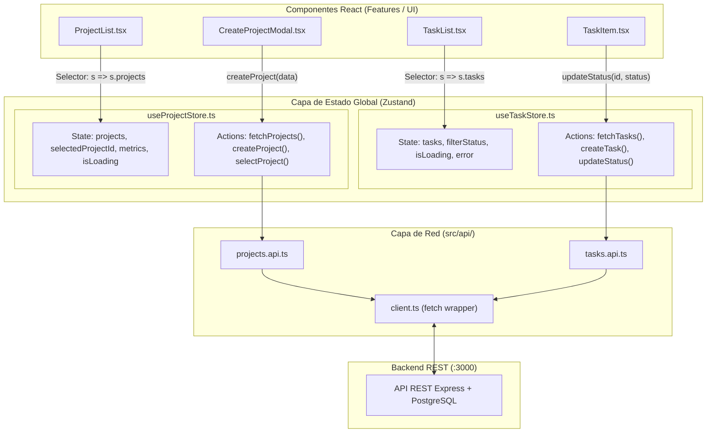

# GUIA MAESTRA DE PREPARACION TECNICA FULLSTACK (SPRINT 2 DIAS)
### Proyecto de Practica: **TaskFlow TI - Sistema de Gestion de Proyectos, Tareas y Metricas**
**Dirigido a:** Practicante Profesional de Desarrollo de Sistemas TI  
**Stack:** React + TypeScript + Tailwind CSS + Zustand | Node.js + Express (REST) | PostgreSQL Local | Git + Testing

---

## Indice de Contenidos
1. [Vision General y Objetivo del Proyecto](#1-vision-general-y-objetivo-del-proyecto)
2. [Levantamiento de Requerimientos y Criterios de Aceptacion (Gherkin)](#2-levantamiento-de-requerimientos-y-criterios-de-aceptacion-gherkin)
3. [Diseno y Scripts de Base de Datos (PostgreSQL Local)](#3-diseno-y-scripts-de-base-de-datos-postgresql-local)
4. [Especificacion del Backend (Node.js + TypeScript + Express)](#4-especificacion-del-backend-nodejs--typescript--express)
5. [Especificacion del Frontend (React + TypeScript + Tailwind CSS + Zustand)](#5-especificacion-del-frontend-react--typescript--tailwind-css--zustand)
6. [Cronograma de 2 Dias con Checklist de Avance](#6-cronograma-de-2-dias-con-checklist-de-avance)
7. [Plan de Control de Versiones (Git Flow & Commits Semanticos)](#7-plan-de-control-de-versiones-git-flow--commits-semanticos)
8. [Estrategia de Pruebas Funcionales y de Integracion](#8-estrategia-de-pruebas-funcionales-y-de-integracion)
9. [Plantilla Oficial de README para tu Repositorio](#9-plantilla-oficial-de-readme-para-tu-repositorio)
10. [Repaso Teorico Rapido: Preguntas Tipicas de Entrevista](#10-repaso-teorico-rapido-preguntas-tipicas-de-entrevista)
11. [Banderas Rojas y Errores Fatales a Evitar](#11-banderas-rojas-y-errores-fatales-a-evitar)

---

## 1. Vision General y Objetivo del Proyecto

### Por que este proyecto para tu entrevista tecnica?
En una prueba tecnica para **Practicante Profesional TI**, el evaluador busca evaluar **fundamentos solidos y criterio ingenieril**:
- Estructurar una base de datos relacional con claves foraneas e integridad referencial.
- Dominio de SQL (`JOIN`, `GROUP BY`, agregaciones condicionales y transacciones ACID).
- Backend con arquitectura limpia (capas desacopladas: Repository, Service, Controller).
- Validacion estricta de datos de entrada y manejo semantico de errores HTTP.
- Frontend moderno y reactivo con **React, TypeScript, Tailwind CSS y Zustand** para gestion de estado global sin sobrecargar con Context API.
- Control de versiones profesional con Git (ramas semanticas y commits atomicos).

**TaskFlow TI** aborda una casuistica empresarial real: centralizar proyectos internos, tickets/tareas de desarrollo, asignacion de etiquetas (bugs, features, urgencias) y calculo dinamico del porcentaje de avance en tiempo real.

---

## 2. Levantamiento de Requerimientos y Criterios de Aceptacion (Gherkin)

### Requerimientos Funcionales (Historias de Usuario)

#### **HU-01: Gestion del Portafolio de Proyectos**
*Como lider o analista de TI, quiero crear y listar proyectos internos para organizar las iniciativas del area.*
- **Criterio 1.1 (Campos obligatorios):** El proyecto debe tener un `name` (string, entre 3 y 80 caracteres) y un `description` (opcional, max. 500 caracteres).
- **Criterio 1.2 (Unicidad):** No se pueden registrar dos proyectos con el mismo nombre (responder con `409 Conflict`).
- **Criterio 1.3 (Estado del Proyecto):** Un proyecto inicia con estado `'ACTIVO'`. Puede cambiarse a `'ARCHIVADO'`.

#### **HU-02: Gestion de Tareas de un Proyecto (Relacion 1 a N)**
*Como desarrollador de TI, quiero registrar y administrar tareas dentro de un proyecto especifico para mantener el seguimiento de mis actividades.*
- **Criterio 2.1 (Creacion):** Cada tarea debe pertenecer a un proyecto existente (`project_id`). Campos: `title` (obligatorio, 3 a 120 caracteres), `description`, `priority` (`'BAJA'`, `'MEDIA'`, `'ALTA'`), `status` (`'PENDIENTE'`, `'EN_PROCESO'`, `'COMPLETADA'`) y `due_date` (fecha limite opcional).
- **Criterio 2.2 (Regla de negocio - Proyecto Archivado):** **NO** se puede crear una tarea ni modificar su estado si el proyecto al que pertenece esta `'ARCHIVADO'` (debe devolver `400 Bad Request` con mensaje descriptivo).
- **Criterio 2.3 (Transicion de estado y completed_at):** Cuando una tarea pasa a `'COMPLETADA'`, el sistema debe registrar automaticamente la marca de tiempo `completed_at = CURRENT_TIMESTAMP`. Si regresa a `'PENDIENTE'` o `'EN_PROCESO'`, `completed_at` debe resetearse a `NULL`.

#### **HU-03: Categorizacion con Etiquetas (Relacion N a N)**
*Como usuario del sistema, quiero asociar una o varias etiquetas a cada tarea para clasificarlas por tipo (ej: Bug, Frontend, Backend, Urgente).*
- **Criterio 3.1:** Una tarea puede tener multiples etiquetas asociadas, y una etiqueta puede pertenecer a multiples tareas.
- **Criterio 3.2 (Evitar duplicados):** La relacion debe garantizar unicidad (`PRIMARY KEY (task_id, tag_id)`).
- **Criterio 3.3 (Transaccionalidad):** Si se asignan multiples etiquetas en bloque a una tarea, debe ejecutarse en una transaccion de base de datos (`BEGIN ... COMMIT`).

#### **HU-04: Calculo Dinamico de Metricas de Progreso**
*Como supervisor o evaluador tecnico, quiero consultar un resumen estadistico de cada proyecto para conocer su porcentaje de completitud y distribucion de estados.*
- **Criterio 4.1:** Debe calcularse mediante una consulta SQL agregada:
  - Total de tareas.
  - Cantidad de tareas en `PENDIENTE`, `EN_PROCESO` y `COMPLETADA`.
  - Porcentaje de avance: `(tareas_completadas / total_tareas) * 100`.
- **Criterio 4.2 (Division por cero):** Si el proyecto tiene 0 tareas, el porcentaje debe ser `0.0%` sin generar excepciones.

---

## 3. Diseno y Scripts de Base de Datos (PostgreSQL Local)

La base de datos local se denomina `taskflow_db`.

### 3.1 Script DDL Completo (`backend/database/schema.sql`)

```sql
-- backend/database/schema.sql

CREATE EXTENSION IF NOT EXISTS "uuid-ossp";

DROP TABLE IF EXISTS task_tags CASCADE;
DROP TABLE IF EXISTS tags CASCADE;
DROP TABLE IF EXISTS tasks CASCADE;
DROP TABLE IF EXISTS projects CASCADE;

-- 1. Tabla Proyectos
CREATE TABLE projects (
    id UUID PRIMARY KEY DEFAULT uuid_generate_v4(),
    name VARCHAR(80) NOT NULL UNIQUE,
    description TEXT,
    status VARCHAR(20) NOT NULL DEFAULT 'ACTIVO' CHECK (status IN ('ACTIVO', 'ARCHIVADO')),
    created_at TIMESTAMP WITH TIME ZONE DEFAULT CURRENT_TIMESTAMP,
    updated_at TIMESTAMP WITH TIME ZONE DEFAULT CURRENT_TIMESTAMP
);

-- 2. Tabla Tareas (Relacion 1 a N con projects)
CREATE TABLE tasks (
    id UUID PRIMARY KEY DEFAULT uuid_generate_v4(),
    project_id UUID NOT NULL REFERENCES projects(id) ON DELETE CASCADE,
    title VARCHAR(120) NOT NULL,
    description TEXT,
    priority VARCHAR(10) NOT NULL DEFAULT 'MEDIA' CHECK (priority IN ('BAJA', 'MEDIA', 'ALTA')),
    status VARCHAR(20) NOT NULL DEFAULT 'PENDIENTE' CHECK (status IN ('PENDIENTE', 'EN_PROCESO', 'COMPLETADA')),
    due_date DATE,
    completed_at TIMESTAMP WITH TIME ZONE NULL,
    created_at TIMESTAMP WITH TIME ZONE DEFAULT CURRENT_TIMESTAMP,
    updated_at TIMESTAMP WITH TIME ZONE DEFAULT CURRENT_TIMESTAMP
);

-- 3. Tabla Etiquetas (Catalogo)
CREATE TABLE tags (
    id UUID PRIMARY KEY DEFAULT uuid_generate_v4(),
    name VARCHAR(40) NOT NULL UNIQUE,
    color_hex VARCHAR(7) NOT NULL DEFAULT '#3B82F6',
    created_at TIMESTAMP WITH TIME ZONE DEFAULT CURRENT_TIMESTAMP
);

-- 4. Tabla Puente Tareas - Etiquetas (Relacion N a N)
CREATE TABLE task_tags (
    task_id UUID NOT NULL REFERENCES tasks(id) ON DELETE CASCADE,
    tag_id UUID NOT NULL REFERENCES tags(id) ON DELETE CASCADE,
    assigned_at TIMESTAMP WITH TIME ZONE DEFAULT CURRENT_TIMESTAMP,
    PRIMARY KEY (task_id, tag_id)
);

-- 5. Indices para optimizacion de consultas
CREATE INDEX idx_tasks_project_id ON tasks(project_id);
CREATE INDEX idx_tasks_status ON tasks(status);
CREATE INDEX idx_task_tags_tag_id ON task_tags(tag_id);
```

### 3.2 Script de Datos Iniciales (`backend/database/seeds.sql`)

```sql
-- backend/database/seeds.sql

INSERT INTO tags (id, name, color_hex) VALUES
('a0000000-0000-0000-0000-000000000001', 'Bug', '#EF4444'),
('a0000000-0000-0000-0000-000000000002', 'Feature', '#10B981'),
('a0000000-0000-0000-0000-000000000003', 'Backend', '#8B5CF6'),
('a0000000-0000-0000-0000-000000000004', 'Frontend', '#3B82F6'),
('a0000000-0000-0000-0000-000000000005', 'Urgente', '#F59E0B');

INSERT INTO projects (id, name, description, status) VALUES
('b0000000-0000-0000-0000-000000000001', 'Migracion Intranet TI', 'Actualizacion de sistemas legados a microservicios', 'ACTIVO'),
('b0000000-0000-0000-0000-000000000002', 'Portal de Soporte al Usuario', 'Sistema interno de tickets de soporte tecnico', 'ACTIVO'),
('b0000000-0000-0000-0000-000000000003', 'Auditoria Servidores 2025', 'Proyecto cerrado de revision de infraestructura', 'ARCHIVADO');

INSERT INTO tasks (id, project_id, title, description, priority, status, due_date, completed_at) VALUES
('c0000000-0000-0000-0000-000000000001', 'b0000000-0000-0000-0000-000000000001', 'Configurar pool de PostgreSQL', 'Crear conexion con pg y variables de entorno', 'ALTA', 'COMPLETADA', CURRENT_DATE + 3, CURRENT_TIMESTAMP),
('c0000000-0000-0000-0000-000000000002', 'b0000000-0000-0000-0000-000000000001', 'Disenar API de autenticacion JWT', 'Implementar middleware de verificacion de tokens', 'ALTA', 'EN_PROCESO', CURRENT_DATE + 5, NULL),
('c0000000-0000-0000-0000-000000000001', 'b0000000-0000-0000-0000-000000000001', 'Crear interfaz responsiva en Tailwind', 'Maquetar dashboard con cards y modales', 'MEDIA', 'PENDIENTE', CURRENT_DATE + 7, NULL),
('c0000000-0000-0000-0000-000000000004', 'b0000000-0000-0000-0000-000000000002', 'Integrar notificaciones por correo', 'Envio automatico al cambiar estado de ticket', 'BAJA', 'PENDIENTE', CURRENT_DATE + 10, NULL);

INSERT INTO task_tags (task_id, tag_id) VALUES
('c0000000-0000-0000-0000-000000000001', 'a0000000-0000-0000-0000-000000000003'),
('c0000000-0000-0000-0000-000000000001', 'a0000000-0000-0000-0000-000000000002'),
('c0000000-0000-0000-0000-000000000002', 'a0000000-0000-0000-0000-000000000003'),
('c0000000-0000-0000-0000-000000000002', 'a0000000-0000-0000-0000-000000000005'),
('c0000000-0000-0000-0000-000000000003', 'a0000000-0000-0000-0000-000000000004');
```

---

## 4. Especificacion del Backend (Node.js + TypeScript + Express)

### 4.1 Estructura en 3 Capas
```text
backend/
├── src/
│   ├── config/             # Variables de entorno y Pool de PostgreSQL
│   ├── types/              # Interfaces TypeScript y DTOs
│   ├── errors/             # Jerarquia de errores AppError (400, 404, 409)
│   ├── schemas/            # Esquemas Zod (compatibles con Zod 4)
│   ├── middlewares/        # validate.middleware y errorHandler.middleware
│   ├── repositories/       # SQL puro parametrizado ($1, $2)
│   ├── services/           # Reglas de negocio y transacciones
│   ├── controllers/        # Controladores HTTP (reciben req, envian res)
│   ├── routes/             # Router de Express
│   ├── app.ts              # Configuracion de middlewares y rutas
│   └── server.ts           # Listen HTTP con tsx
├── database/               # schema.sql y seeds.sql
├── package.json
└── tsconfig.json
```

### 4.2 Catalogo de Endpoints REST
| Metodo | Endpoint | Parametros / Body | Descripcion |
|---|---|---|---|
| `GET` | `/api/health` | Ninguno | Estado online de la API |
| `GET` | `/api/projects` | Query opcional: `?status=ACTIVO` | Lista todos los proyectos |
| `GET` | `/api/projects/:id` | Param: `id` (UUID) | Detalle del proyecto |
| `POST` | `/api/projects` | Body: `{ name, description? }` | Crea proyecto (valida unicidad) |
| `GET` | `/api/projects/:id/metrics` | Param: `id` (UUID) | Calculo SQL de metricas y % avance |
| `GET` | `/api/projects/:projectId/tasks` | Query: `?status=...&priority=...` | Tareas del proyecto con sus tags |
| `POST` | `/api/tasks` | Body: `{ project_id, title, priority?, ... }` | Crea tarea (falla si proyecto esta archivado) |
| `PATCH` | `/api/tasks/:id/status` | Body: `{ status }` | Actualiza estado y completed_at |

---

## 5. Especificacion del Frontend (React + TypeScript + Tailwind CSS + Zustand)

### 5.1 Justificacion Tecnica: Por que Zustand frente a Context API?

En pruebas tecnicas, el uso indiscriminado de React Context API para estado del servidor suele ser cuestionado por evaluadores experimentados debido a dos problemas principales:
1. **Provider Hell:** Obliga a anidar proveedores (`<ProjectProvider><TaskProvider>...`) alrededor de toda la aplicacion en `main.tsx`.
2. **Re-renderizados innecesarios:** Si un valor dentro del Context cambia, **todos** los componentes que consuman ese contexto se re-renderizan por defecto, a menos que se apliquen tecnicas complejas de memoizacion.

**Zustand** resuelve estos problemas de raiz:
- **Cero Providers:** El estado se define fuera del arbol de componentes; se puede leer o actualizar desde cualquier componente sin envolver la app.
- **Selectores Atomicos:** Cada componente se suscribe unicamente a la porcion exacta del estado que necesita (ej. `const projects = useProjectStore(s => s.projects)`). Si el estado de carga o las metricas cambian, el componente no se re-renderiza innecesariamente.
- **Acciones Asincronas Directas:** Las llamadas de red (`fetch`) se integran limpiamente dentro del store como funciones `async/await`, eliminando la necesidad de `useEffect` repetitivos y desordenados en los componentes.

### Diagrama de Flujo: Arquitectura del Estado con Zustand



---

### 5.2 Estructura Reestructurada de Carpetas del Frontend

```text
frontend/
├── src/
│   ├── api/                    # Capa de comunicacion HTTP pura (Fetch nativo)
│   │   ├── client.ts           # Helper generico de peticiones y manejo de respuestas
│   │   ├── projects.api.ts     # Funciones: getProjects, getProjectMetrics, createProject
│   │   └── tasks.api.ts        # Funciones: getTasksByProject, createTask, updateTaskStatus
│   ├── stores/                 # Estado global desacoplado con Zustand
│   │   ├── useProjectStore.ts  # Proyectos, proyecto activo, metricas y acciones async
│   │   └── useTaskStore.ts     # Tareas del proyecto, filtros de estado y mutaciones
│   ├── types/                  # Interfaces TypeScript compartidas
│   │   ├── project.types.ts
│   │   └── task.types.ts
│   ├── components/             # Componentes visuales reutilizables
│   │   ├── common/
│   │   │   ├── Button.tsx      # Boton accesible con variantes (primary, danger, ghost)
│   │   │   ├── Badge.tsx       # Etiquetas de estado, prioridad y tags con Tailwind
│   │   │   ├── Modal.tsx       # Dialogo modal accesible con backdrop
│   │   │   ├── ProgressBar.tsx # Barra reactiva con transicion CSS del % de avance
│   │   │   └── Spinner.tsx     # Indicador de carga animado
│   │   └── layout/
│   │       ├── Navbar.tsx      # Barra de navegacion responsive
│   │       └── Container.tsx   # Contenedor centrado con max-width
│   ├── features/               # Modulos por dominio de negocio
│   │   ├── projects/
│   │   │   ├── ProjectCard.tsx # Tarjeta con barra de avance y boton para ver tareas
│   │   │   ├── ProjectList.tsx # Grid responsive (1 col movil, 2 tablet, 3 desktop)
│   │   │   └── CreateProjectModal.tsx
│   │   └── tasks/
│   │       ├── TaskItem.tsx    # Elemento de tarea con toggle rapido de estado y tags
│   │       ├── TaskList.tsx    # Listado de tareas con estados de carga y vacio
│   │       ├── TaskFilterBar.tsx # Tabs de filtrado interactivo (Todas, Pendientes, Completadas)
│   │       └── CreateTaskModal.tsx
│   ├── App.tsx                 # Orquestador: alterna entre vista de proyectos y detalle de tareas
│   ├── main.tsx                # Punto de entrada de React
│   └── index.css               # Directivas de Tailwind CSS
├── package.json
├── tsconfig.json
└── vite.config.ts
```

---

### 5.3 Tipado TypeScript en el Frontend (`src/types/`)

```typescript
// src/types/project.types.ts
export type ProjectStatus = 'ACTIVO' | 'ARCHIVADO';

export interface Project {
  id: string;
  name: string;
  description: string | null;
  status: ProjectStatus;
  created_at: string;
  updated_at: string;
}

export interface ProjectMetrics {
  project_id: string;
  project_name: string;
  total_tasks: number;
  completed_tasks: number;
  in_progress_tasks: number;
  pending_tasks: number;
  completion_percentage: number;
}

export interface CreateProjectDTO {
  name: string;
  description?: string;
}
```

```typescript
// src/types/task.types.ts
export type TaskPriority = 'BAJA' | 'MEDIA' | 'ALTA';
export type TaskStatus = 'PENDIENTE' | 'EN_PROCESO' | 'COMPLETADA';

export interface Tag {
  id: string;
  name: string;
  color_hex: string;
}

export interface Task {
  id: string;
  project_id: string;
  title: string;
  description: string | null;
  priority: TaskPriority;
  status: TaskStatus;
  due_date: string | null;
  completed_at: string | null;
  created_at: string;
  updated_at: string;
  tags?: Tag[];
}

export interface CreateTaskDTO {
  project_id: string;
  title: string;
  description?: string;
  priority?: TaskPriority;
  due_date?: string;
  tag_ids?: string[];
}
```

---

### 5.4 Capa de Red con Fetch Nativo (`src/api/`)

#### Cliente base (`src/api/client.ts`)
```typescript
// src/api/client.ts
const BASE_URL = 'http://localhost:3000/api';

export interface ApiResponse<T> {
  success: boolean;
  data?: T;
  message?: string;
  errors?: Array<{ field: string; message: string }>;
}

export async function apiClient<T>(
  endpoint: string,
  options: RequestInit = {}
): Promise<T> {
  const url = `${BASE_URL}${endpoint}`;
  const headers = {
    'Content-Type': 'application/json',
    ...options.headers,
  };

  const response = await fetch(url, { ...options, headers });
  const json: ApiResponse<T> = await response.json();

  if (!response.ok || !json.success) {
    const errorMsg = json.message || 'Error en la solicitud al servidor';
    throw new Error(errorMsg);
  }

  return json.data as T;
}
```

#### Funciones de Proyectos (`src/api/projects.api.ts`)
```typescript
// src/api/projects.api.ts
import { apiClient } from './client.js';
import { Project, ProjectMetrics, CreateProjectDTO } from '../types/project.types.js';

export const getProjects = () => apiClient<Project[]>('/projects');
export const getProjectMetrics = (id: string) => apiClient<ProjectMetrics>(`/projects/${id}/metrics`);
export const createProject = (data: CreateProjectDTO) =>
  apiClient<Project>('/projects', {
    method: 'POST',
    body: JSON.stringify(data),
  });
```

#### Funciones de Tareas (`src/api/tasks.api.ts`)
```typescript
// src/api/tasks.api.ts
import { apiClient } from './client.js';
import { Task, CreateTaskDTO, TaskStatus } from '../types/task.types.js';

export const getTasksByProject = (projectId: string, status?: string) => {
  const query = status ? `?status=${status}` : '';
  return apiClient<Task[]>(`/projects/${projectId}/tasks${query}`);
};

export const createTask = (data: CreateTaskDTO) =>
  apiClient<Task>('/tasks', {
    method: 'POST',
    body: JSON.stringify(data),
  });

export const updateTaskStatus = (id: string, status: TaskStatus) =>
  apiClient<Task>(`/tasks/${id}/status`, {
    method: 'PATCH',
    body: JSON.stringify({ status }),
  });
```

---

### 5.5 Tiendas Globales con Zustand (`src/stores/`)

Instalacion:
```powershell
npm --prefix frontend install zustand
```

#### Store de Proyectos (`src/stores/useProjectStore.ts`)
```typescript
// src/stores/useProjectStore.ts
import { create } from 'zustand';
import { Project, ProjectMetrics, CreateProjectDTO } from '../types/project.types.js';
import { getProjects, getProjectMetrics, createProject } from '../api/projects.api.js';

interface ProjectState {
  projects: Project[];
  selectedProjectId: string | null;
  activeMetrics: ProjectMetrics | null;
  isLoading: boolean;
  error: string | null;

  // Acciones
  fetchProjects: () => Promise<void>;
  selectProject: (id: string | null) => Promise<void>;
  refreshMetrics: (id: string) => Promise<void>;
  addProject: (data: CreateProjectDTO) => Promise<void>;
}

export const useProjectStore = create<ProjectState>((set, get) => ({
  projects: [],
  selectedProjectId: null,
  activeMetrics: null,
  isLoading: false,
  error: null,

  fetchProjects: async () => {
    set({ isLoading: true, error: null });
    try {
      const data = await getProjects();
      set({ projects: data, isLoading: false });
    } catch (err: any) {
      set({ error: err.message, isLoading: false });
    }
  },

  selectProject: async (id: string | null) => {
    set({ selectedProjectId: id, activeMetrics: null });
    if (id) {
      await get().refreshMetrics(id);
    }
  },

  refreshMetrics: async (id: string) => {
    try {
      const metrics = await getProjectMetrics(id);
      set({ activeMetrics: metrics });
    } catch (err: any) {
      console.error('Error al actualizar metricas:', err);
    }
  },

  addProject: async (data: CreateProjectDTO) => {
    set({ isLoading: true, error: null });
    try {
      const newProject = await createProject(data);
      set((state) => ({
        projects: [newProject, ...state.projects],
        isLoading: false,
      }));
    } catch (err: any) {
      set({ error: err.message, isLoading: false });
      throw err;
    }
  },
}));
```

#### Store de Tareas (`src/stores/useTaskStore.ts`)
```typescript
// src/stores/useTaskStore.ts
import { create } from 'zustand';
import { Task, CreateTaskDTO, TaskStatus } from '../types/task.types.js';
import { getTasksByProject, createTask, updateTaskStatus } from '../api/tasks.api.js';
import { useProjectStore } from './useProjectStore.js';

interface TaskState {
  tasks: Task[];
  filterStatus: TaskStatus | 'TODAS';
  isLoading: boolean;
  error: string | null;

  // Acciones
  fetchTasks: (projectId: string) => Promise<void>;
  setFilterStatus: (status: TaskStatus | 'TODAS') => void;
  addTask: (data: CreateTaskDTO) => Promise<void>;
  changeStatus: (id: string, newStatus: TaskStatus) => Promise<void>;
}

export const useTaskStore = create<TaskState>((set, get) => ({
  tasks: [],
  filterStatus: 'TODAS',
  isLoading: false,
  error: null,

  fetchTasks: async (projectId: string) => {
    set({ isLoading: true, error: null });
    try {
      const currentFilter = get().filterStatus;
      const statusParam = currentFilter === 'TODAS' ? undefined : currentFilter;
      const data = await getTasksByProject(projectId, statusParam);
      set({ tasks: data, isLoading: false });
    } catch (err: any) {
      set({ error: err.message, isLoading: false });
    }
  },

  setFilterStatus: (status) => {
    set({ filterStatus: status });
    const selectedId = useProjectStore.getState().selectedProjectId;
    if (selectedId) {
      get().fetchTasks(selectedId);
    }
  },

  addTask: async (data: CreateTaskDTO) => {
    set({ isLoading: true, error: null });
    try {
      const newTask = await createTask(data);
      set((state) => ({
        tasks: [newTask, ...state.tasks],
        isLoading: false,
      }));
      // Sincronizar metricas del proyecto en el otro store
      useProjectStore.getState().refreshMetrics(data.project_id);
    } catch (err: any) {
      set({ error: err.message, isLoading: false });
      throw err;
    }
  },

  changeStatus: async (id: string, newStatus: TaskStatus) => {
    try {
      const updated = await updateTaskStatus(id, newStatus);
      set((state) => ({
        tasks: state.tasks.map((t) => (t.id === id ? { ...t, ...updated } : t)),
      }));
      const selectedId = useProjectStore.getState().selectedProjectId;
      if (selectedId) {
        useProjectStore.getState().refreshMetrics(selectedId);
      }
    } catch (err: any) {
      set({ error: err.message });
    }
  },
}));
```

---

### 5.6 Consumo de Stores en Componentes React con Selectores

Para optimizar los renders de la aplicacion, se utilizan selectores atomicos:

#### Ejemplo: `ProjectList.tsx`
```tsx
// src/features/projects/ProjectList.tsx
import { useEffect } from 'react';
import { useProjectStore } from '../../stores/useProjectStore.js';
import { ProjectCard } from './ProjectCard.js';
import { Spinner } from '../../components/common/Spinner.js';

export function ProjectList() {
  // Selectores atomicos: solo suscribe a los cambios de estas propiedades
  const projects = useProjectStore((s) => s.projects);
  const isLoading = useProjectStore((s) => s.isLoading);
  const fetchProjects = useProjectStore((s) => s.fetchProjects);
  const selectProject = useProjectStore((s) => s.selectProject);

  useEffect(() => {
    fetchProjects();
  }, [fetchProjects]);

  if (isLoading && projects.length === 0) {
    return <Spinner message="Cargando proyectos..." />;
  }

  return (
    <div className="grid grid-cols-1 md:grid-cols-2 lg:grid-cols-3 gap-6">
      {projects.map((project) => (
        <ProjectCard
          key={project.id}
          project={project}
          onSelect={() => selectProject(project.id)}
        />
      ))}
    </div>
  );
}
```

---

### 5.7 Puntos Criticos de UI / UX con Tailwind CSS
1. **Responsive Mobile-First:**
   - Grid de proyectos: `grid grid-cols-1 md:grid-cols-2 lg:grid-cols-3 gap-6`.
   - Modales: `w-full max-w-lg p-6 bg-white rounded-xl shadow-xl mx-4 sm:mx-auto`.
2. **Barra de Progreso Dinamica:**
   ```tsx
   <div className="w-full bg-gray-200 rounded-full h-2.5">
     <div 
       className={`h-2.5 rounded-full transition-all duration-300 ${
         percentage === 100 ? 'bg-green-600' : 'bg-blue-600'
       }`} 
       style={{ width: `${percentage}%` }}
     />
   </div>
   ```
3. **Empty States:** Si no hay elementos, mostrar un mensaje informativo y accesible en lugar de dejar un espacio en blanco.

---

## 6. Cronograma de 2 Dias con Checklist de Avance

### DIA 1: Backend, PostgreSQL y Git
- [ ] **Bloque 1 (09:00 - 11:30): Entorno, Git y Base de Datos**
  - [x] Crear repositorio en Git local: `git init`.
  - [x] Crear base de datos `taskflow_db` en PostgreSQL local.
  - [x] Ejecutar `schema.sql` y `seeds.sql`.
  - [x] Inicializar `backend/` con TypeScript, `package.json`, Express, `pg`, `zod` y `tsx`.
  - [ ] Commit 1: `feat(database): setup postgresql schema and seed data`
- [ ] **Bloque 2 (11:45 - 14:30): Capas del Backend y CRUD Proyectos**
  - [x] Configurar pool en `src/config/database.ts`.
  - [x] Crear arquitectura: `Repository -> Service -> Controller -> Routes`.
  - [x] Implementar `GET /api/projects` y `POST /api/projects` con validacion Zod 4.
  - [x] Implementar endpoint de metricas calculadas con SQL agregado.
  - [x] Probar endpoints en Postman.
  - [ ] Commit 2: `feat(backend): implement project management and metrics query`
- [ ] **Bloque 3 (15:30 - 18:00): Tareas, Relacion N-N y Reglas de Negocio**
  - [ ] Implementar CRUD de tareas con filtro por `project_id`.
  - [ ] Validar regla: si el proyecto esta `'ARCHIVADO'`, rechazar creacion y edicion de tarea.
  - [ ] Asociar etiquetas N-N con transaccion `BEGIN ... COMMIT` en PostgreSQL.
  - [ ] Implementar `PATCH /api/tasks/:id/status` que alterne `completed_at`.
  - [ ] Middleware global de manejo de errores activo.
  - [ ] Commit 3: `feat(backend): implement tasks crud with tag relations and business validations`
- [ ] **Bloque 4 (18:15 - 19:45): Pruebas de Integracion y Cierre de Rama**
  - [ ] Instalar Jest y Supertest.
  - [ ] Escribir 3 tests de integracion para endpoints clave.
  - [ ] Ejecutar tests y validar que pasen en verde.
  - [ ] Commit 4: `test(backend): add supertest integration suite for core endpoints`

---

### DIA 2: Frontend con Zustand, Integracion y Documentacion
- [ ] **Bloque 1 (09:00 - 11:30): Setup React, Tailwind y Capa de API**
  - [x] Inicializar frontend con Vite: `npm create vite@latest frontend -- --template react-ts`.
  - [x] Configurar Tailwind CSS y soporte de iconos (`lucide-react`).
  - [ ] Instalar Zustand: `npm install zustand`.
  - [ ] Crear interfaces TypeScript en `src/types/`.
  - [ ] Crear cliente base con fetch nativo en `src/api/client.ts`.
  - [ ] Commit 5: `feat(frontend): setup vite, typescript, tailwind, zustand and api layer`
- [ ] **Bloque 2 (11:45 - 14:30): Stores Zustand y Vistas de Proyectos**
  - [ ] Implementar `src/stores/useProjectStore.ts` con acciones asincronas.
  - [ ] Crear `Navbar.tsx` y `Container.tsx`.
  - [ ] Crear `ProjectCard.tsx` con barra de progreso y `ProjectList.tsx` con grid responsive.
  - [ ] Crear modal de registro de nuevo proyecto con formulario controlado.
  - [ ] Commit 6: `feat(frontend): implement zustand project store and dashboard views`
- [ ] **Bloque 3 (15:30 - 17:45): Modulo de Tareas, Filtros y Sincronizacion**
  - [ ] Implementar `src/stores/useTaskStore.ts` con filtro por estado.
  - [ ] Crear `TaskItem.tsx` con checkbox reactivo y badges de etiquetas.
  - [ ] Crear `TaskFilterBar.tsx` para alternar entre estados (Todas, Pendientes, Completadas).
  - [ ] Verificar que al completar una tarea se actualicen las metricas del proyecto automaticamente.
  - [ ] Commit 7: `feat(frontend): add task management, state filters and reactive metrics`
- [ ] **Bloque 4 (18:00 - 20:00): README, Evidencia de IA y Repaso Tecnico**
  - [ ] Escribir el `README.md` final del proyecto con arquitectura y endpoints.
  - [ ] Documentar el uso asistido de herramientas de IA.
  - [ ] Repasar preguntas de entrevista sobre Zustand, ciclo de vida en React y PostgreSQL.
  - [ ] Commit 8: `docs: complete repository documentation, architecture overview and setup guide`

---

## 7. Plan de Control de Versiones (Git Flow & Commits Semanticos)

### Estructura de Ramas Recomendada
```text
main                (Produccion / Version final pulida)
 │
 └── develop         (Rama de integracion principal)
      ├── feature/database-and-backend-core
      ├── feature/backend-tasks-and-validation
      ├── feature/frontend-zustand-and-ui
      └── docs/readme-and-architecture
```

### Comandos de Ejemplo para el Flujo de Trabajo
```bash
# 1. Inicializar repositorio y rama base
git init
git branch -M main
git checkout -b develop

# 2. Crear rama para el frontend y trabajar
git checkout -b feature/frontend-zustand-and-ui
git add .
git commit -m "feat(frontend): implement zustand stores and responsive taskboard"

# 3. Mergear a develop cuando la funcionalidad este probada
git checkout develop
git merge --no-ff feature/frontend-zustand-and-ui -m "merge: integrate frontend zustand ui"

# 4. Al finalizar los 2 dias, llevar la version terminada a main
git checkout main
git merge --no-ff develop -m "release: v1.0.0 fullstack task management platform"
```

---

## 8. Estrategia de Pruebas Funcionales y de Integracion

### Ejemplo de Prueba con Supertest (`backend/tests/integration/projects.test.ts`)
```typescript
import request from 'supertest';
import app from '../../src/app.js';

describe('API de Proyectos - Pruebas de Integracion', () => {
  it('Debe responder 200 y un array al consultar GET /api/projects', async () => {
    const res = await request(app).get('/api/projects');
    expect(res.status).toBe(200);
    expect(res.body.success).toBe(true);
    expect(Array.isArray(res.body.data)).toBe(true);
  });

  it('Debe devolver 400 Bad Request si se intenta crear un proyecto con nombre vacio', async () => {
    const res = await request(app)
      .post('/api/projects')
      .send({ name: '' });
    expect(res.status).toBe(400);
    expect(res.body.success).toBe(false);
  });
});
```

---

## 9. Plantilla Oficial de README para tu Repositorio

```markdown
# TaskFlow TI - Sistema de Gestion de Proyectos y Tareas

Solucion integral fullstack desarrollada para la gestion, control de tareas y metricas operativas del equipo de TI.

## Stack Tecnologico
- **Frontend:** React 19, TypeScript, Tailwind CSS, Zustand, Lucide Icons, Vite
- **Backend:** Node.js, Express 5, TypeScript, Zod (Validacion de esquemas)
- **Base de Datos:** PostgreSQL local (consultas SQL parametrizadas y transacciones ACID)
- **Pruebas:** Jest, Supertest
- **Control de Versiones:** Git Flow y Conventional Commits

## Arquitectura del Frontend con Zustand
El frontend implementa una arquitectura modular con Zustand para la gestion de estado global:
- **Zero Providers:** Elimina la necesidad de envolver la aplicacion en multiples Providers de Context API.
- **Selectores Atomicos:** Minimizan los re-renderizados suscribiendo cada componente unicamente a la propiedad requerida.
- **Capa de Red Desacoplada:** El cliente fetch nativo esta aislado en `src/api/` y es consumido de forma asincrona por las tiendas (`src/stores/`).

## Catalogo de Endpoints REST
| Metodo | Ruta | Descripcion |
|---|---|---|
| `GET` | `/api/projects` | Lista todos los proyectos |
| `POST` | `/api/projects` | Registra un nuevo proyecto |
| `GET` | `/api/projects/:id/metrics` | Calcula metricas y % de avance con SQL |
| `GET` | `/api/projects/:projectId/tasks` | Tareas de un proyecto con sus tags |
| `POST` | `/api/tasks` | Registra tarea (valida si el proyecto esta activo) |
| `PATCH` | `/api/tasks/:id/status` | Actualiza estado y fecha de completitud |

## Pasos de Instalacion y Ejecucion
1. **Base de Datos:**
   - Crear base de datos: `createdb taskflow_db`
   - Ejecutar scripts: `psql -d taskflow_db -f backend/database/schema.sql` y `seeds.sql`.
2. **Backend:**
   - `cd backend && npm install`
   - Configurar variables en `.env`
   - `npm run dev`
3. **Frontend:**
   - `cd frontend && npm install`
   - `npm run dev`
```

---

## 10. Repaso Teorico Rapido: Preguntas Tipicas de Entrevista

### React, TypeScript & Zustand
1. **Por que usar Zustand en lugar de Context API o Redux Toolkit?**
   *Respuesta:* Context API no esta optimizado para estados que cambian con frecuencia (como listas de tareas o filtros); cada actualizacion del contexto fuerza el re-renderizado de todos los componentes consumidores a menos que se apliquen memoizaciones complejas. Redux Toolkit, por otro lado, anade demasiado boilerplate (reducers, dispatches, slices) para una aplicacion de tamano mediano. Zustand ofrece una API minimalista basada en hooks, soporte nativo de TypeScript, acciones asincronas directas y selectores que eliminan re-renderizados innecesarios.
2. **Como funciona un selector en Zustand?**
   *Respuesta:* Un selector es una funcion que extrae una propiedad especifica del estado (ej. `useProjectStore(s => s.projects)`). Zustand realiza una comparacion estricta (`===`) de la porcion devuelta; el componente solo se vuelve a renderizar si el valor exacto seleccionado cambio, ignorando actualizaciones en otras propiedades del store.
3. **Cual es la diferencia entre un componente controlado y uno no controlado?**
   *Respuesta:* En un componente controlado, el valor del formulario esta vinculado al estado de React (`useState` o Zustand) y se actualiza en cada cambio (`onChange`). En uno no controlado, el valor es leido directamente del DOM utilizando una referencia (`useRef`).

### Node.js & APIs REST
1. **Que es el Event Loop en Node.js?**
   *Respuesta:* Es el mecanismo que permite a Node.js realizar operaciones de I/O no bloqueantes a pesar de ser monohilo. Delega tareas asincronas pesadas (disco, red, base de datos) a la libreria `libuv`, y ejecuta los callbacks en el hilo principal a medida que se completan.
2. **Por que se deben usar codigos de estado HTTP semanticos?**
   *Respuesta:* Para que el cliente comprenda con precision el resultado de la peticion sin inspeccionar el cuerpo: `200` (exito de lectura), `201` (recurso creado), `400` (error en datos de entrada), `404` (recurso no encontrado), `409` (conflicto o duplicado), `500` (error interno del servidor).

### PostgreSQL
1. **Cual es la diferencia entre `INNER JOIN` y `LEFT JOIN`?**
   *Respuesta:* `INNER JOIN` solo devuelve filas cuando hay coincidencias en ambas tablas. `LEFT JOIN` devuelve todas las filas de la tabla izquierda, rellenando con `NULL` si no hay coincidencias en la tabla derecha (util para listar proyectos que aun no tienen tareas).
2. **Que es una transaccion de base de datos (ACID)?**
   *Respuesta:* Una secuencia de operaciones que se ejecutan como una unidad atomica (todo o nada). Si una sentencia falla en medio del proceso, se invoca un `ROLLBACK` para evitar dejar la base de datos en un estado inconsistente.

### Git
1. **Cual es la diferencia entre `git merge` y `git rebase`?**
   *Respuesta:* `merge` preserva el historial cronologico exacto creando un commit de union. `rebase` toma los commits de una rama y los vuelve a aplicar uno a uno sobre la punta de otra rama, dejando un historial lineal.

---

## 11. Banderas Rojas y Errores Fatales a Evitar

> [!CAUTION]
> **Lo que NUNCA debes hacer en tu prueba tecnica:**
> 1. **Quedarte callado:** Si te piden programar en vivo o explicar tu solucion, narra tu razonamiento en voz alta para evidenciar tu proceso logico.
> 2. **Concatenar variables en queries SQL:** Escribir `'SELECT * FROM tasks WHERE project_id = ' + id` es motivo de descalificacion por vulnerabilidad de Inyeccion SQL. Usa siempre parametros: `WHERE project_id = $1`.
> 3. **Subir archivos innecesarios al repositorio:** Subir `node_modules/`, archivos `.env` con claves o carpetas de build `.dist/`.
> 4. **No manejar estados de carga y error en la UI:** Dejar la interfaz congelada en blanco mientras el backend responde sin mostrar un spinner o mensaje descriptivo.
> 5. **Abusar de Context API para todo:** Crear 4 o 5 contextos anidados para estado de red cuando una libreria de estado moderna como Zustand simplifica la arquitectura y el rendimiento.

---

Sigue este plan bloque por bloque y tendras un proyecto y conocimientos fullstack listos para superar tu entrevista tecnica con exito.
